# 해커톤 매뉴얼

본 메뉴얼은 [오픈핵(소프트웨어중심대학 오픈소스 해커톤)](https://sigoss.github.io/hackathon2017-2/index.html)을 운영/진행했던 국민대학교 오픈소스소프트웨어 연구실에서 
전국의 소프트웨어중심대학을 비롯한 각급 학교를 포함하여 
해커톤을 진행하고자 하는 모든 조직들이 참고할 수 있도록 만든 매뉴얼 입니다.
문서에 오류를 발견하시면 아래 작성자에게 알려주시거나, 직접 수정하여 Pull Request를 날려주시고,
추가를 원하는 내용이 있으시면 이슈로 등록해주시면 고려하겠습니다.
고맙습니다.

### 이 문서의 작성자
* [이 민석](mailto:ykhl1itj@gmail.com),
[신 수철](mailto:hisfact@gmail.com),
[손 건](mailto:fjen6b@gmail.com),
[홍 승환](mailto:hj332921@gmail.com)

이 매뉴얼의 간단한 버전에 해당하는 문서도 있습니다. [가이드북 - 해커톤 계획하기](http://www.snpo.kr/bbs/board.php?bo_table=npo_aca&wr_id=486) 이며 서울시 NPO 지원센터에서, 코드나무 자원활동가들이 [원문](http://socrata.com/wp-content/uploads/2013/05/How-to-Run-a-Hackathon.pdf)을 번역 자료 추가해서 만들었습니다. 같이 보시면 도움이 될 듯합니다.

</img> 
이 문서는 크리에이티브 커먼즈 저작자표시 2.0 대한민국 라이선스에 따라 
누구나 이용할 수 있습니다.

해커톤이란
---

> 해커톤(영어: hackathon)은 소프트웨어 개발 분야의 프로그래머나 관련된 그래픽 디자이너, 사용자 인터페이스 설계자, 프로젝트 매니저 등이 집중적으로 작업을 하는 소프트웨어 관련 프로젝트의 이벤트이다.
> 개인이 따로 작업하는 경우, 조를 나눠 하나의 목표를 위해 작업하는 경우 등이 있다. 경우에 따라 하드웨어 부품을 다루는 경우도 있다. 해커톤은 1일부터 1주일 정도의 기간으로 개최된다.
> 경우에 따라서는 단순히 교육이나 사회적 목적과 의도를 가지고 열리기도 하지만, 대개는 새로운 소프트웨어의 개발, 또는 기존 소프트웨어의 개선을 목표로 한다. 
> 해커톤은 특별한 테마, 예컨데 프로그래밍 언어, 운영 체제, 응용 프로그램, API, 주제 등을 정해 놓고 열리는 경우도 있으며, 아무 제한 없이 열리는 경우도 있다. (from 위키피디아 ['해커톤'](https://ko.wikipedia.org/wiki/해커톤), ['hackathon'](https://en.wikipedia.org/wiki/Hackathon))

위 내용은 해커톤에 대한  위키피디아의 내용이다. 해커톤은 무언가를 만든다/파고든다는 의미인 Hack과 장시간 달리기를 의미하는 Marathon의 합성어로 모여서 무언가를 집중적으로 만드는 행사의 의미로 사용되고 있다.

### 해커톤 예시
* 개발 생태계 활성화 : 특정 API 혹은 생태계를 홍보하고 개발자들의 참여를 유도하기 위한 목적. 예, 구글 개발자 그룹 (GDG) 해커톤, 개발자 커뮤니티에서 자생적으로 만들어지는 해커톤 
* 창업 : 창업 아이템의 프로토타입을 만들어보고 창업을 하거나 투자를 유치하기 위한 목적. 예, 스타트업위크엔드 (Startup Weekend)
* 사회 혁신 : 사회적 문제를 해결하기 위한 목적. 예, sicamp36 (소셜이노베이션 캠프 36) 
* 사내 혁신 : 사내의 다양한 문제 해결, 새로운 서비스 아이디어 개발,
사내 혁신 문화를 만들기 위한 목적.
* 교육 : 해커톤 기간 중 만들어 내는 결과물도 중요하지만, 결과보다는 소프트웨어 개발 방법론, 협업 등 개발 역량을 강화시키기 위한 목적. 예, OPENHACK(소프트웨어중심대학 오픈소스 해커톤) 

### 목차
* [해커톤 계획](#해커톤-계획)
    - [목적과 목표의 설정](#목적과-목표의-설정)
    - [인원 등 행사 규모 결정](#인원-등-행사-규모-결정)
    - [날짜와 기간 결정](#날짜와-기간-결정)
    - [장소 선정](#장소-선정)
    - [홈페이지 준비와 참가자 모집](#홈페이지-준비와-참가자-모집)
    - [운영 인력 확보](#운영-인력-확보)
    - [비용 추산](#비용-추산)
    - [후원자 섭외](#후원자-섭외)
    - [해커톤 홍보하기](#해커톤-홍보하기)
    - [운영 세부 매뉴얼 정하기](#운영-세부-매뉴얼-정하기)
    - [타임테이블 구성](#타임테이블-구성)
    - [공간 및 물품 준비하기](#공간-및-물품-준비하기)
    - [먹거리 계획하기](#먹거리-계획하기)
* [해커톤 진행](#해커톤-진행)
    - [해커톤 시작 전 준비](#해커톤-시작-전-준비)
    - [참가자 등록 및 강연](#참가자-등록-및-강연)
    - [오프닝](#오프닝)
    - [아이디어 발표와 팀 빌딩](#아이디어-발표와-팀-빌딩)
    - [팀별 작업](#팀별-작업)
    - [최종 발표 준비](#최종-발표-준비)
    - [최종결과 발표 및 종료](#최종결과-발표-및-종료)
    - [행사 종료 직후](#행사-종료-직후)
* [해커톤 마무리](#해커톤-마무리)
    - 수상팀 정보 취합
    - 상장 발급 및 배송
    - 정산
    - 결과보고서 작성
    - 결과 홍보
    - 결과 홈페이지 구축
    - 결과 메일 보내기
* 부록
    - [기본 타임테이블](#기본-타임테이블)
    - [행사 사진](#행사-사진)
    - [출력물 및 물품 사진](#출력물-및-물품-사진)

# 해커톤 계획 

해커톤을 계획하는 단계에서는 제일 먼저 해커톤의 목적과 목표를 설정하고, 참가 인원과 날짜, 
그에 따라 장소를 정한다. 그리고 대강의 정보를 담은 홈페이지를 만들고 필요하면 후원자를 모집한다.

[목차로 돌아가기](#목차)

## 목적과 목표의 설정

해커톤의 목적은 아주 명확해야 한다. 많은 사람의 노력, 참가자들의 소중한 시간,
그리고 비용도 적지 않게 들어가는 행사에 확실한 명분과 목적이 필요하다. 

**해커톤을 위한 해커톤이 안되도록** 목적을 잘 정의하여야 한다.

현실적으로 많은 해커톤은 해커톤 개최를 위한 비용의 출처가 되는 조직에서 
행사의 목적 그리고 대개는 목표까지 정할 가능성이 높다. 
그리고 늘 그 목적을 잘 홍보하고, 정량적인 목표를 성공적으로 달성해주는 
행사 전문 회사들이 있다. 해커톤을 그런 회사들에게 맡겨버리는 경우라면 이 매뉴얼을
읽을 필요도 없다. 이 매뉴얼은 해커톤을 직접 계획하고 운영하는 사람들을 위한 것이다.

또 특히 공공기관 주도의 해커톤이나 위에서 오더가 내려온 기업의 해커톤에서
벌어지는 일인데, 오프닝 행사에 양복입은 사람들이 나와서 차례로 귀빈 소개하고, 
뻔한 연설을 하는 시간이 길면 절대 안된다.
그런 행사는 상금이 매우 많지 않다면, 또는 대통령 상이 없다면
그 해가 마지막이 될 가능성이 높다. 
해커톤에서 지루한 시간이 길면 안된다.
이 매뉴얼에서는 *의전* 이런 고려는 없다.

해커톤을 하는 목적은 위 [해커톤 예시](#해커톤-예시)에서 비교적 명확하게 드러난다. 
그 개최 이유에 참가자들의 네트위킹, 재미, 역량의 향상, 새로운 기술의 발견, 
해커톤 이후 활동에 대한 기대 등이 목적에 포함될 수 있겠다. 

**해커톤의 목표**는 개최할 해커톤 행사의 결과물에 관한 것으로
참가자 직군 분류에 따른 인원 수와 몇 개의 앱, 서비스 또는 아이디어, 
또는 창업 케이스를 만들 것인지 등의 숫자가 되겠다. 

또 여러 차례 반복되는 행사라면 보통 설문에 의해 얻어지는 행사 품질에 관한 내용도
목표로 설정할 수 있다. 

[목차로 돌아가기](#목차)

## 인원 등 행사 규모 결정

해커톤의 규모에는 정해진 가이드라인이 없다. 해커톤 규모는 참가자 수로 정해진다.
작게는 5 ~ 10명 정도의 소규모로 진행해도 된다.
하지만 많이 모여서 해커톤을 하면 결과물의 다양성을 더 확보할 수 있고,
참가자들의 개인적 참가 목적이 더 잘 달성될 가능성이 높다.
늘 그렇듯이 비용이 문제다. 참가 인원에 비례하지는 않지만 인원이 늘어나면
공간 임대료, 음식을 비롯한 모든 비용이 증가하는 것이 당연하다.
(비용은 인원에 따라 선형적으로 증가하다가
공간 비용 때문에 어느 수준에서 계단으로 증가하고 다시 선형, 계단이 반복된다.)

일반적으로 안정적인 운영을 위한 규모로 스태프를 포함하여 
총 60 ~ 70명 정도를 추천하며,
주최/후원 등으로 인하여 규모가 커져야 할 경우에도 
총 100 ~ 120명 정도까지를 권장한다.
참가자 뿐만 아니라 진행자, 운영 스탭의 수도 중요하다. 
선수로 참가하는 사람 수의 20% 정도의 스탭이 필요하다고 생각하면 된다.

참가자들의 직군에도 정해진 가이드가 있지는 않으나, 소프트웨어적인 결과물을
만들어내는 것이 해커톤에서 해야할 일이라면, 원활한 작업과 완성도를 위하여
팀 별로 적어도 개발자 2명(프론트 엔드, 백 엔드), 디자이너 1명(UI/UX),
그리고 필요하면 프로젝트 매니저 1명 정도가 필요하다.
프로젝트 매니저는 기획자로 표현하기도 하나, 심각한 것을
만들지 않는다면 직군과 상관없이 모든 팀원들이 기획 역량을 발휘할 수도 있다.
**분류(직군)별 참가자 수가 해커톤의 목표 달성에 큰 영향을 준다.**

해커톤을 준비하는 쪽에서는
'우리가 이렇게 좋은 해커톤이 있는데 구름같이 참가하겠지..'라고 생각하겠지만,
참가자 수를 크게 계획하면 원하는 역량을 가진 참가자를 계획한 수 만큼
모으기도 쉽지 않다. 또 디자이너와 같은 특정 직군의 경우, 생각보다 참가자 모으기가 
어려워서 매우 유명 디자이너를 멘토로 초빙하거나, 
디자인 관련 튜토리얼을 제공하는 등의 참여 동기부여가 필요하고,
그래도 안될 때는 사례를 지불하고 초청할 수도 있다.

[목차로 돌아가기](#목차)

## 날짜와 기간 결정

많은 해커톤은 2박 3일의 일정으로 진행된다.
2박 3일의 일정이 참여자들이 체력 등을 안배해가며
전체 일정을 조율할 수 있는 꽤 적당한 일정이기 때문이다.
2박 3일로 진행하는 경우, 참가자들의 원래 일상을 고려하여 
금요일 저녁 6 ~ 7시에 등록을 시작하고 (퇴근 후 이동 시간 고려) 오프닝, 팀빌등을
저쳐 저녁 8 ~ 9시부터는 본격적으로 
개발을 진행하여 일요일 오후 일찍 끝내는 정도가 좋다. 
2박 3일 이상이면 숙박 또는 편하게 쉴 수 있고 씻을 수 있는 공간을 확보해야 한다.

1박 2일의 경우, 충분한 구현 시간을 확보하기 어렵기 때문에 
참가자 모두가 밤샘 작업을 해야하는 것을 가정하는 경우가 많다. 
즉, 숙소나 편한 쉴 곳에 대한 부담이 적어진다.
1박 2일 일정이라면 
토요일 오전 또는 오후 일찍 시작하여 보통은 일요일 오후 늦게까지 진행한다.

어떤 해커톤은 팀을 미리 정하고(또는 팀 단위로 모집하고),
사전 모임, 워크샵을 먼저 진행하여, 공통적으로 학습이 필요한 부분을 배우고, 
이후 1 ~ 3주정도 팀별로 개발을 진행하다가, 마지막에 1박 2일 정도 해커톤을
모여서 하는 경우도 있다. 개발 결과물의 완성도가 매우 중요한 목표라면
이 방법도 좋다.

하지만 예상 참가자들의 상황, 해커톤의 목적 및 목표에 따라 얼마든지 
해커톤 기간과 일정을 조정할 수 있다.

해커톤 개최 날짜 역시 언제가 딱 좋은 그런 것은 없으나,
예상 참가자들의 통상적인 일정을 고려하면 좋을 것이다. 
학생이 주 참가자라면 중간고사, 기말고사, 축제 일정을 참고해야 한다.
또 휴가철이나 워낙 다른 행사도 많은 5월, 10월도 불리하다. 
요즘은 방학 때도 학생들이 바빠서 일정 잡기가 쉽지 않다.

주최 측의 공간을 쉽게 대여할 수 있는 경우가 아니라면, 
꽤 많은 사람이 참가하는 행사이니 만큼 
무료로 빌릴 수 있는 공간은 말할 것도 없고,
유료 공간도 구하기가 만만치가 않다. 
가능한 일찍 날짜를 확정하고 장소 섭외를 해야한다. 

특히 사내 해커톤처럼 업무의 일환이거나 
교내에서 교과 활동의 일환으로 해커톤을 하는
경우는 기관의 주요 업무 일정을 고려해야 하고, 
해커톤 참가자들이 야간에 작업을 하는 시간을
업무 시간으로 볼 것인가에 대한 이슈를 고려해야한다.

[목차로 돌아가기](#목차)

## 장소 선정

해커톤이 열리는 장소는 해커톤의 목표 달성과, 
참가자들의 만족도에 꽤 중요한 요인 가운데 하나이다.

일찍 행사 일정이 확정되면, 해커톤 성격에 따라 
행사 목적과 같은 설립 취지를 가진 기관의 공간을 
무료나 아주 저렴하게 빌릴 수 있는 경우도 있지만, 
행사일에 임박할수록, 행사 규모가 클수록, 숙박이 필요할수록, 
행사장을 구하기는 쉽지 않고, 비용도 점점 증가한다.

짧은 시간 동안 많은 사람들이 모여 집중적인 작업을 진행하기 때문에 쾌적하고, 
집중이 잘 되는 공간을 확보해야 한다.

장소는 기본적으로 바닥이 평평하고, 
모든 팀이 다 같은 공간에서 작업 할 수 있을 만큼 넓으며,
층고가 높은 공간이 가장 좋다.

숙박이 필수는 아니나 2박 3일 해커톤의 경우, 참여자들을 위한 숙소 또는 편하게 
쉴 공간이 따로 반드시 필요하고, 1박 2일 해커톤의 경우에도 쉴 공간이 있으면 좋다.
1박 2일이라도 해커톤을 지원하는 스태프들이 쉴 수 있는
별도의 공간, 숙소는 반드시 준비하여야 한다.

참가자들이 알아서 할 문제이기도 하지만,
행사 장소를 일부러 외진 곳, 대중 교통이 불편한 곳, 밤 되면 문을 잠그는 곳 등을
선택하면, 집중도가 높아지기도 한다. (예를 들면, 산속에 있는 수련원, 
유람선을 빌려서 한다거나, ~~연수원 가운데는 밤에 문을 잠그는 곳도 있다.)

행사 규모가 크면 항상 안전 문제가 따른다. 장소에 따라 필요하다면 주변 경찰서에 미리 
이런 행사가 있다고 알려고, 순찰 강화를 요청하는 것도 좋다.

### 해커톤 추천장소

해커톤 일정, 참가자 수에 따라 적당하지 않을 수도 있지만,
또 어디에서든 해커톤을 할 수는 있지만, 해커톤이 자주 개최되는 공간은 다음과 같다.
늘 그렇듯이 무료이거나 싸고 좋은 곳은 일찍 예약해야 한다. 

- D.CAMP, 마루180, 구글 캠퍼스 서울 등 창업 공간
- 서울시립대 강촌 수련원 등 주요 대학 수련원
- 서울 유스호스텔 등 청소년 수련원
- 서울시 청년청 등 지자체 공간
- 대학, 학교의 컨퍼런스 룸, 강당, 체육관
- 지역 창조경제혁신센터들
- 코워킹 스페이스들
- 기업의 연수원들 (최근에 신입사원 공채가 줄면서, 예전보다 여유가 있다)
- 개포지디털혁신파크, 소프트웨어 마이스트로 센터
- 제주도 또는 지방의 컨벤션 시설이 있는 리조트
- 호텔 또는 호텔 수준의 서비스를 제공한 북한강 변의 고급 연수 시설 
- ...

### 해커톤 장소 사전답사 체크리스트

추천을 받거나, 안내를 보고 후보지로 고려한다면 
유선 상으로 조건을 확인함은 당연하고 **반드시 사전 답사**를 한다.
장소 선정을 위한 체크리스트는 다음과 같다. 
행사 일정에 따라 필요없는 것도 있으나, 필요성이 있는 사안에 대하여 
꼼꼼하게 체크하고 공간의 제약 사항에 대하여 혹시 참가자들이 미리 알아야
할 사항이 있다면, 참가신청서에 언급하고 참가 확정 메일과 현장 등록 때 안내한다.

    [v] 모든 참가자들을 수용할 수 있는 큰 작업 공간이 있는가?
    [v] 공간은 냉난방, 환기 등이 쾌적하게 되는가?
    [v] 작업 공간과 같은 공간에서 팀 빌딩, 최종 발표도 가능한가?
    [v] 팀 단위로 작업 테이블 배치가 여유롭게 가능한가?
    [v] 진행과 발표를 위한 선명한 빔프로젝터와 스크린이 있는가?
    [v] 여러 개의 (무선) 마이크를 쓸 수 있는 음향 장비가 쓸만한 성능인가?
    [v] 현수막, 포스터, X-배너, 포토월 등을 설치,부착할 수 있는가?
    [v] 충분한 대역폭의 WiFi, 초고속 인터넷이 가능한가?
    [v] 참가자 모두가 노트북을 쓸 충분한 용량의 전기 설비가 있는가?
    [v] 대중 교통 접근성은 어떠한가?
    [v] 스태프들이 쉴 수 있는 분리된 공간이 있는가?
    [v] 분리된 강의실, 작은 미팅룸이 있는가?
    [v] 행사 물품을 보관할 창고로 쓸 공간이 있는가?
    [v] 구내 식당이 있는가?
    [v] 식당이 있다면 식당의 음식의 품질은 어떠한가?
    [v] 식당 비용은 총 인원수, 식사한 인원수 어떤 기준인가?
    [v] 식당에 행사 기간동안 특식 주문이 가능한가?
    [v] 식당과 행사장의 거리는 가까운가?
    [v] 외부 케이터링, 도시락, 피자, 치킨, 푸드트럭 등의 반입, 배달이 가능한가?
    [v] 정수기가 비치되어 있는가?
    [v] 커피 머신이 있는가?
    [v] 간이 부엌이 있는가?
    [v] 대형마트, 편의점 등은 얼마나 가까운가?
    [v] 공간 자체, 화장실 등 편의 시설은 쾌적한가?
    [v] 화장실 청소, 쓰레기 처리 등은 몇 시까지, 주말에도 관리되는가?
    [v] 일반 쓰레기, 음식물 쓰레기, 분리 수거는 어떻게 처리하는가?
    [v] 주말에 공간 담당 직원이 나와있거나, 연락이 가능한가?
    [v] 야간에 출입 제한이 있는가?
    [v] 흡연 구역이 있는가? 야간에도 접근 가능한가?
    [v] 숙박 시설은 스태프를 포함한 모든 참가자 수용이 가능한가?
    [v] 장소 주변에 추가적인 숙박 시설(호텔, 펜션 등) 확보 가능한가?
    [v] 주차가 가능한가?
    [v] 가장 가까운 응급 의료 시설은 어디인가?
    [v] 가까운 파출소, 관할 경찰서는 어디인가?

[목차로 돌아가기](#목차)

## 홈페이지 준비와 참가자 모집

해커톤을 홍보하여, 참가자를 모으고, 후원자도 섭외하려면 홈페이지가 필요하다. 
참가자 모집은 대부분 해커톤의 경우 아래과 같은 모임 홍보 서비스를 통해서
이루어진다. 이들 사이트에 포스터를 올려 홍보 홈페이지를 대신할 수 있다.

* 온오프믹스 https://onoffmix.com
* 이벤터스 https://event-us.kr
* 밋업 https://www.meetup.com/ko-KR
* festa.&#8203;io https://festa.io/

참가자 모집 양식 자체는 구글 설문지 도구를 활용하면 편하다.

별도의 서버 없이 github.io를 활용하여 홈페이지를 제작할 수도 있다. 
**github.io를 이용하여 홈페이지를 만드는 방법**은 
[pages.github.com](https://pages.github.com)와 인터넷에서 쉽게 찾을 수 있다.
홈페이지를 직접 만드는 경우에도 참가자 신청은 구글 설문지 도구를 쓰는 것이 편하다.

해커톤이 종료된 후에 해커톤 결과와 산출물도 홈페이지를 잘 기록하여 유지하는 것이 좋다.
이 결과는 다음 차수의 해커톤 준비, 후원 요청, 참가자 모집에 큰 도움이 된다.

홈페이지에서 제공되어야 하는 정보와 참가자 모집 양식에 들어가야할 내용은 아래와 같다

- 해커톤의 목적과 목표
- 해커톤의 주제 (정해져 있다면)
- 일정과 장소(구체적인 약도와 함께)
- 공지 사항 (안전 등과 관련한 내용)
- 참가신청 단위와 팀 구성 방법 (개인, 팀)
- 참가비 안내 (액수, 취소/참가 후 환불 여부)
- 참가 신청 양식 링크 (구글 설문지 링크)
- 시상 내역 (상훈, 상금/상품 규모) 
- 주최 (실질적으로 비용을 부담하는 곳)
- 주관 (해커톤을 운영하는 곳)
- 후원사 목록과 로고 (매우 중요)
- 기타 행사 진행 관련 주요 내용
- 행사, 후원, 참가 문의를 위한 연락처
- 예시, 오픈핵 홈페이지, 결과 페이지, 포스터 
http://sigoss.github.io/event170915.html 

참가자 신청 양식에 포함되어야 할 것들은 다음과 같다 (v는 필수 항목)

    [v] 이름
    [ ] (숙박을 제공하는 경우) 성별
    [v] 핸드폰 번호 (현장에서의 연락, 단톡방 개설 용)
    [v] 이메일 (행사 고지 등 기본 통신 수단)
    [v] 비상 연락처 전화번호
    [ ] 소속
    [ ] 참가 직군 (개발자, 디자이너, PM/기획 등, 해커톤 성격에 따라 필수)
    [v] (개별 여행자 보험을 가입하는 경우) 주민등록번호/주소
    [v] 음식물 알러지 여부, 채식 등 특별한 음식 요구
    [ ] 티셔츠 사이즈(세세한 분류보다는 3~4개 사이즈) 등 기념품 옵션
    [ ] 신청 후 선발 과정이 있는 경우, 선발에 필요한 정보들
    [ ] 기타 주최 측이 알아야할 개인적 특이 사항
    [ ] (유료 신청인 경우) 참가비 납부 방법
    [ ] 공결서 필요 여부
    [v] 개인정보 활용에 동의
    [ ] (청소년의 경우) 법정대리인 동의서 제출 의무 고지
    [v] 신청 후, 어떤 과정을 통해 참가가 확정되는지와 확정 일정 안내

대부분 해커톤의 목표는 다양성을 존중하는 철학 위에서 달성된다.
따라서 해커톤에서는 행사의 목적과 목표에 따라 참가 자격을 제한할 수는 있으나,
**어떠한 차별도 두어서는 안된다**. 
특별히 참여 직군별로 참가자에게 어떤 역량이 필요한 경우, 
행사의 목적, 목표에 미루어 참가자 스스로 신청 여부를 판단하도록 하는 것이 보통이다.
개발 역량은 온라인 알고리즘 테스트와 같은 도구로 최소한의 검증을 하는 경우도 있으며, 
github id, 이력서 등을 신청 때 요구할 수도 있다.

청소년, 어린이가 참석 대상인 경우, 법정 대리인의 동의가 필요하다. 양식을 준비하여
이메일 또는 현장 제출을 하도록 하자.

참가비를 받을 것인지 받는다면 얼마로 할 것인지는 주최 측이 결정할 문제이다.
해커톤의 성격과 제공되는 물품이나 서비스에 의해 결정할 수 있고,
모든 비용을 주최 측이나 후원으로 조달 가능하다해도, 
No-Show 방지용으로 상징적인 적은 금액을 받거나, 
적당한 금액을 받은 뒤 행사 후 일부 또는 전체를 환불하기도 한다.

특정 목적을 가진 해커톤의 경우, 엉뚱한 참가자의 신청을 배재하기 위해서,
참가자 모집 홍보를 그 목적에 부합하는 채널로만 하는 것이 당연하다.

[목차로 돌아가기](#목차)

## 운영 인력 확보

해커톤 운영에는 많은 사람들이 필요하다. 
커뮤니티 주도의 해커톤은 100% 자원봉사자들이 헤커톤을 운영하지만,
해커톤 주최측의 예산이 있다면 적당한 페이를 지급하는 것이 맞다.
**일이 정말 많다**.

해커톤에 필요한 인력은 아래와 같다. 이 모든 인력들도 참가 등록에 준하는 등록을
하도록 한다. 이름표 제작, 보험 가입 등에 필요하다.

* 오거나이저 : 행사 총괄, 지원/후원 기관 연락, 홍보 등에서 
이 행사의 대표성을 가지는 사람
* 진행자 : 해커톤의 처음과 끝을 담당한다. 
진행자는 참가자는 물론 다른 운영 스태프들과 가장 많은 인터랙션을 하는 사람으로
해커톤 진행에서 가장 중요하다. 
기본적으로 개발자 및 해커톤 문화에 대한 전반적인 이해가 있어야 한다. 
그러므로 해커톤에 참여해 본 경험이 많으며 해당 해커톤이 추구하는 목표와 철학을 
공유하는 사람이 담당할 것을 권장한다. 진행자는 해커톤이 끝난 뒤에 운영 인력 중
참가자들의 기억에 남는 거의 유일한 인물이기 때문에 발언과 행동에 주의해야 한다.
해커톤을 주로 진행하는 전문진행자도 있기는 하다.
* 아이스브레이커 : 진행자가 같이 할 수도 있지만, 네트워킹, 아이스브레이킹을 위한
특별한 이벤트 (Gamification, 요가, 게임 대회 등)를 전문적으로 진행하는 사람
* 총무 : 주최측 예산, 현금, 현물과 후원으로 확보한 자원을 관리하고 예산을 통제한다. 
현금의 경우 지출시 영수증 관리 등을 엄격하게 해야 하며,
전반적인 상황을 구글 스프레드시트 등을 통해 정리 및 공유할 수 있어야 한다.
* 디자인 팀 : (외주로 처리하지 않는다면) 출력물 및 기념품, 굿즈를 디자인을 담당할 팀 
* 개발 팀 : 해커톤 홈페이지, 그리고 진행 상황에 대한 평가/모니터링을 위한 도구,
Dashboard가 필요하다면 그 소프트웨어를 사전에 만들거나, 
customize하는 해커톤 뒷단의 기술적 운영 팀, 
디자인 팀과 개발 팀은 전문적인 영역을 담당하는 스태프로서 
이들도 해커톤 준비과정을 통해서 역량이 키워질 수 있도록 디자인, 
개발 프로세스를 지키고, 멘토링을 받을 수 있도록 배려한다.
디자인 팀과 개발 팀은 절대적인 사전 작업 시간이 필요한 팀이다. 이들끼리 다 모여서 
별도의 해커톤을 진행해서 빠르게 일을 해치우는 것도 방법이다.
* 강연자 : 행사 개막 키노트 강연을 해 줄 사람. 가능하면 Named 강연자를 섭외한다.
또 해커톤 참가자들에게 필요한 사전 지식 또는 관련 기술을 강의해 줄 전문가.
* 멘토 : 해커톤 전 기간 또는 일부 기간동안 참가자와 같은 공간에서, 
참가자들이 작업을 진행하면서 직면하게 되는 기술적 문제들을 해결하는데 
도움을 줄 수 있는 사람. 보통은 개발자 커뮤니티의 역량 높은 개발자, 유관 기업,
후원사의 시니어 개발자 및 디자이너, 특별한 분야에 정통한 대학원생 등을 확보한다.
**특히 디자이너들이 참여한다면 디자인 멘토도 섭외하면 좋을 것이다.**
* 심사위원 : 별도의 심사위원이 필요하다면 해당 전문가를 섭외한다.
[운영 세부 매뉴얼 정하기](#운영-세부-매뉴얼-정하기) 참조 
* 촬영팀 : 행사의 기록을 남기기 위한 인력으로 기본적으로 2인 이상이 필요하다.
현장 스케치 영상, 최종 발표 스트리밍(페이스북 또는 유투브 라이브 등등)을 담당한다.
사전 교육세션, 키노트, 중간발표, 결과발표 등 주요 진행 내용을 페이스북 또는
유투브로 스트리밍으로 공유할 수 있으며, 
행사 종료에는 현장 스케치 영상, 스틸 사진들을 편집하여 제공한다. 
이 촬영물들을 SNS 등을 통해 공유하고, 해커톤 결과 보고 및 홍보에 활용한다.
* **운영 스태프** : 남은 모든 일은 운영 스태프의 몫이다.
단순한 잡무를 하는 인력이 아니라 해커톤이 문제없이 돌아가게 만드는 
역할을 담당하므로 이들이 의욕적으로 일하고, 
보람을 느낄 수 있도록 각별한 배려가 필요하다.
행사 기간동안 가장 고생하는 인력이며 충분한 유무형의 보상이 필요하다.
또 이들이 교대로 일을 할 수 있도록 사전에 교대 시간표를 만들고, 
근무가 아닌 시간에는 충분히 쉴 수 있도록 별도의 휴식, 취침 공간을 제공한다. 
**해커톤 참가자들이 쉽게 지킬 수 있는 행동 수칙을 정해 공지를 하겠지만, 
많은 참가자가 있으므로 여러 이유로 지켜지지 않거나, 
예상보다 시간이 많이 걸릴 수 있을 가능성에 
운영 스태프들은 항상 대비하여야 한다**. 
운영 스태프는 각 팀의 작업 테이블을 절대 청소하지 않는다. 
행사 중, 작업 테이블 위는 각 팀의 몫이다.
운영 스태프가 하는 일은 다음과 같다.

    - 참가자 안내 : 등록, 일정, 공간 사용, 이동, 단체 교통, 숙소 입퇴실
    - 인프라 관리 : 네트워크, 화면, 오디오, 전기 배선 등
    - 행사 물품 관리 : 모든 행사 물품의 수급, 배치 등
    - 공간 관리 : 쓰레기 처리, 화장실, 정수기 등 관리

운영 스태프와 행사 진행 인력들은 해커톤 행사 전에 사전 미팅이 필요하고,
해커톤 현장에도 전날 또는 당일 일찍 도착하여 준비를 하고 마음의 준비를 해야한다. 

[목차로 돌아가기](#목차)

## 비용 추산

해커톤을 운영하는 데에는 상당한 비용이 소요된다.

해커톤에 소요되는 비용은 장소 임대, 숙박 비용, 참가 인원에 따른 먹거리 비용,
강연/멘토/심사자/진행자/스태프 인건비, 상금, 기타 비용 등으로 구성된다.
늘 그렇듯이 case-by-case 이다.
해커톤 규모가 커지면 장소 비용 때문에 참가자 1인당 비용도 커진다.
해커톤이 고급스러움을 추구할 필요는 없지만, 가능하면 쾌적한 공간, 깨끗한 잠자리,
맛있고 영양도 풍부한 먹거리, 그리고 최고의 멘토가 있어야 하지 않겠는가?

예산이 얼마나 드나? 바로 답을 해야한다면 수천만원이라고 해야한다.
정말로 정하기 나름인 상금을 제외하고 
숙박을 제공하는 2박3일, 60-70명 규모라면 1인당 최소 40만원 정도,
100명이 넘는다면 1인당 80만원 정도로 추산하면 얼추 맞는다.

금요일 저녁부터 토요일 오후까지 1박 2일로
학교 공간에서 100% 자원봉사 스탭들이 운영하고
밥은 학교 식당이나 완전 저렴한 도시락 먹고, 아침은 김밥먹고,
간식은 치킨 조금 먹으면서, 상금도 총 수십만원으로 제한한
40 ~ 50명정도 행사라면 수백만원도 안들 것이다.

스탭을 비롯한 모든 인력은 자원봉사로 해결할 수도 있으나,
정말로 자발적인 자원봉사가 아니라면, 
또는 일부러 초청했다면 당연히 비용이 지불되어야 한다.
멘토나 평가를 오시는 전문가의 경우, 
최소한 그 분의 휴가 대체 수당 수준 이상의 비용을 지불하는 것이 맞겠다.
완전 자발적인 동기로 진행되는 커뮤니티 해커톤이 아니라면 
인건비를 절약하려는 노력은 하지 않는 것이 좋다. 
훌륭한 스탭과 전문가를 모시는데 비용을 쓰고, 그 분들이 돈 때문에 오지는 않지만 
다음에 또 오시라고 연락할 때 그나마 덜 미안한 마음을 가질 수 있다.

비용 가운데 팀별로 개발에 필요한 노트북이나 기타 장비와 재료는 보통 자부담이다.

다음 리스트는 가능한 소요 비용 항목을 나열한 것이다.

    * 장소 대관비 : 장소 (행사장, 준비실 등) 대여 및 기본 장비
    * 숙박비 : 참가자, 스태프, 멘토, 전문가
    * 식비 : 식사비, 야식비, 음료, 과자, 과일, 음료 등 온갖 먹거리
    * 재료비 : (있다면) 해커톤 목적에 따른 공통 재료비 (하드웨어, AWS, ...)
    * 장비비 : 고속 WiFi 지원 장비, 프로젝터/스크린, 무전기, 멀티탭 등 임대/구입비
    * 문구류 : 이젤패드, 포스트잇, 네임펜, 테입, 스티커, ...
    * 출력물 : 이름표, 현수막, X-배너, 포토월 등 디자인비 및 인쇄비
    * 홍보비 : 행사 및 참가자 모집 홍보비 (페이스북 광고, 배너 광고)
    * 기념품 : 웰컴킷 (티, 후드, 텀블러 등), 굿즈, 참여도 향상을 위한 상품
    * 촬영비 : 사진, 동영상 촬영 및 편집
    * 교통비 : 단체 이동 시 버스 전세, 비행기 요금
    * 보험료 : 행사 및 참가자 여행 단체 보험 
    * 상금 : 대회 상금, 이벤트 상품 등
    * 전문가 인건비 : 키노트, 튜토리얼 강의, 멘토 자문료, 평가위원비
    * 참가자 지원비 : (특정 직군의 모집이 안되서) 초청한 참가자 지원  
    * 진행자 인건비 : 메인 진행자, 이벤트 진행자 인건비
    * 스탭 인건비 : 100% 자원 봉사가 아닌 스탭들 인건비
    * 행사비 : 아이스 브레이킹 행사용 물품, 상품비
    * 이벤트 : Gamification, 요가, ... 
    * 개발비 : 해커톤을 위한 소프트웨어 개발비 (필요하다면)
    * 수수료 : 참가비, 후원금 결제 대행 수수료
    * 서버 운영비 : 해커톤 홈페이지 도메인 구입, 서버 운영비
    * 준비비 : 사전 답사 비용, 운영진 회의비
    * 우편료 : 홍보물, 행사물품 배송, 상장 배송 등
    * 예비비 : ...

[목차로 돌아가기](#목차)

## 후원자 섭외

해커톤에는 비용이 적지 않게 든다. 당연히 이를 조달할 방법이 필요하다.

주최기관의 예산으로 부족한 경우 또는 주최기관 자체가 없다면,
해커톤 비용을 충당하기 위해 현금, 현물(식사, 간식, 기념품, 경품, 상품, 굿즈),
멘토링(개발, 디자인) 등등을 제공할 
후원자, 재능기부자, 자원봉사자들을 열심히 찾을 필요가 있다.
꼭 예산이 부족하지 않더라도, 있어 보이기 위해, 참가자 모집에 유리할까 싶어서,
또는 그 후원기관에게 우리 좀 봐달라는 의미로 후원을 받을 수도 있다.

기본적으로 이 땅에는 당신이 지금 준비하는 것보다 훨씬 고매한 목적과 목표를 가진
해커톤/개발자 행사가 매우 많으며, 대부분 후원자를 찾고 있기 때문에
우리 해커톤을 위한 **후원자 모집은 매우 어렵고 경쟁도 심하다고** 보면 된다.
**후원은 못받는 것이 본전이다**.

후원자는 해커톤 주제 관련 회사, 정부기관(정부 출연 연구소 등), 재단,
커뮤니티 등이 될 수 있다.
개인이 후원을 하는 경우도 있으나 보통은 소액이고, 흔하지도 않다.
해커톤에 목적과 목표가 있듯이,
후원하는 쪽에서도 후원하는 돈의 용처가 그 조직의 목적과 목표에 부합해야 한다.
따라서 아무나가 아니라 해커톤의 취지에 맞는 후원자를 찾는 것이 중요하다.

소프트웨어 개발자들이 참여하는 해커톤이라면
시장에선 늘 역량있는 소프트웨어 개발자가 부족하므로,
해커톤이 훌륭한 개발자들이 참여하는 해커톤임을 강조하고,
후원사에게 리크루팅을 위한 발표 시간을 할애하거나,
멘토의 파견을 통한 집적적인 개발자 리크투팅 활동이 가능하다는 점,
적어도 회사의 로고를 개발자들에게 노출시켜 회사에 대한 호감도를 높일 수 있다는 점을 
부각시켜 업체들을 설득한다. 

#### 후원기관 후보

다음은 후원 기관 후보들이다. 
아래 기관 실명은 해당 부류 조직들의 예를 들기 위해 적은 것일 뿐
후원을 잘 해준다는 의미는 절대 아니다. **모든 조직은 나름 가난하다.**

* 주제/참가자 관련 회사들 : 예를들어, 소프트웨어라면, 네이버, 카카오, 구글,
마이크로소프트, 우아한 형제들,… 회사들은 많지만 후원받기는 매우 어렵다. 
동원 가능한 모든 네트워크를 이용하여 높은 포지션의 지인, 홍보/마케팅,
인사 부서를 설득해야 한다.
* 개발자, 스타트업 지원 기관 : 예를들어, 아산나눔재단-마루180,
은행권청년창업재단-D.Camp, … 이 기관들은 각자의 예산 사이클이 있고 경쟁도 심하다.
현금, 또는 공간 후원을 하려면 충분히 일찍 계획하고 요청해야 한다. 
* 국가의 진흥기관들 : 예를들어 ~~원, NIPA, NIA, IITP, … 
이 기관들은 올해의 모든 사업 예산이 작년에 이미 확정되어 있는 상태다.
가끔 짜투리 예산이 남은 경우도 있지만, 
이미 있는 예산 가운데 후원 가능한 예산은 얻기 어렵다.
이 기관들은 보통 후원이 아니라, 주최 기관으로 해커톤 자체를
운영기관 입찰을 통해 지원하게 되며, 
그 돈을 커뮤니티 행사에 쓰려면 모양을 만들어야 하고
모종의 사전 작전이 필요하다는 소문이 있다.  
* 참가자, 개발자 자체가 고객이자 상품(?)인 회사 : 예를들어, 인프런, 
이브레인컨설팅… 교육기관이나 전문 서치펌들은 개발자들을 만나고 싶어한다. 
하지만 전반적으로 가난하다.

**모든 후원자, 후원후보자들은 소중하다.**
선의를 가지고 진행하는 우리 행사를 지원할 가능성이 언제 생길지 모르므로
모든 후원자와 후원후보자들에게 엄청나게 친절하고 정중하게 대하자.
내 후원 요청을 들어주는 것만으로도 너무 고마운 것이다.

해커톤 목적에 맞는 기업이나 단체와 어떤 식으로든 연결이 되면,
가능하면 우선 전화로 취지를 설명하고, 후원 요청서, 제안서를 메일로 전달한다.
어떤 조직이든 후원은 개인 돈으로 하지 않기에 의사 결정 과정이 필요하다.
그리고 보통은 후원을 결정하는 사람과 실무 담당자가 다르다.
양쪽 모두와 친하게 지내자.

#### 후원 요청

후원 요청은 구체적인 계획이 만들어지기 전부터 시작되어야 하기 때문에,
아래 내용을 개략적이라도 정하여 후원 요청을 해야하며,
후원 약속자 또는 유력한 후원 후보에게는 지속적으로,
너무 자주는 말고, 준비, 진행, 결과 보고서까지 진행 상황을 
지속적으로 업데이트한다.

후원 요청 메일에는 다음과 같은 내용이 포함되어야 한다.
다음 내용들은 후원을 할지 말지 결정하는 포인트,
후원을 결정할 수 있는 사람이 아니라면 누군가를 설득해야하는데 
그 설득 포인트로 작용한다. 
또 이번엔 못해도 다음 번엔 할 수 있도록 고려하겠다는 중요한 요인들이 된다.  

* 해커톤의 목적, 목표, 주제 : 즉, **이 해커톤에 후원을 해야하는 이유**
* 개최 일시, 장소
* 참가자에 대한 기술 : 총 인원수, 어떤 역량을 가진 참가자들인지
* 참가자 모집 방법 : 초청 아니면 신청 후 심사해서 선정
* 팀 구성 방법 : 팀 단위로 신청 아니면 현장에서 팀 구성
* 첫 회가 아니라면 : 예년 행사 내용, 결과물 페이지, 사진, 기사 등
* 후원 종류 : 어떤 후원이 가능한지 (현금, 현물, 기타)
* 후원 규모 : 현금 후원의 경우 후원을 원하는 금액
* 후원금 세금 처리 : 계산서 발행 여부, 기부금 처리가 가능한지
* **후원에 대한 혜택** : 후원 기관 로고 노출 등 가능한 혜택

일단 후원을 어떤 식으로든 하기로 결정하고 나면, 
후원하는 회사들의 주요 고민은 
0. 뭘 후원할 지, 
1. 후원 금액은 어느 정도 해야하는지,
2. 그 금액에 대한 증빙 서류를 어떻게 받을 수 있는지,
3. 후원에 대한 대가는 무엇인지 등이다. 

그래서 후원 요청을 할 때는 그런 고민을 줄여주기 위해, 
구체적인 내용을 같이 보내면 좋다.
예를 들어, '현금 후원은 100만원 이상의 금액을 
기대하고 있습니다.'와 같은 내용을 후원 요청 메일에 넣을 것을 권하며,
'얼마 이상이면 후원사 이름의 특별상을 만들 수 있습니다.' 같은 대가도 넣으면
후원자가 후원을 결심하기 쉽겠다.
다른 후원 항목들에 대해서 비슷한 기준을 마련하거나, 
후원 규모, 방법, 대가 관련 질문에 바로 대답할 준비를 하자.
예를 들어 '간식 후원은 참가자가 80명이므로 피자 10판,
치킨 10마리 정도의 결제를 해주시면 고맙겠습니다.',
그밖에도 해커톤 개최 공간, 저녁 식사 1 회분, 기념품 80개, 기타 [굿즈](#스폰서-굿즈),
동영상 강좌 수강 쿠폰, 개발/디자인 멘토 파견, 입사지원시 서류전형 면제권 등의
목록도 좋다.

후원의 대가는 우선 로고 노출 (포스트, 포토월, X배너, 상장, 이름표, 
이름표 목걸이, 티셔츠 등), 키노트 세션에서 발표할 기회, 
회사 기술 튜토리얼 세션 할당, 리크루팅을 위한 발표 시간, 
경쟁이 있는 해커톤이라면 참가 자격 티켓 부여, 
심사위원 참여, 개발/디자인 멘토 파견, 후원사 명의의 특별상,
행사장에 부스 마련 등 할 수 있는 것을 모두 제시한다.

후원금에 대한 증빙서류를 발행할 수 있는지 여부는 매우 중요하다.
운영 조직에서 세금계산서 발행이 안되면 후원할 방법이 없는 기업이 많다.
커뮤니티도 세금계산서를 발행할 수 있는 가벼운 사업자 등록이 가능하므로
세금계산서를 발행하거나, 학회 같이 기부금 영수증도 발행할 수 있다면 더 좋다.
하지만 개인 후원이 아닌 경우, 개인 구좌에 입금은 불가능하거나,
엄청난 명분을 만들어야만 가능하다.
증빙서류 문제가 있을 때, 해커톤 비용의 일부(간식 비용, 티셔츠 값 등)를 
후원 기관의 법인 카드를 사용하거나, 또는 지불 대상 기관의 청구 형식으로 
대신 결제하는 경우도 있다.

#### 크라우드 펀딩

후원자를 찾기 어려운 경우 와디즈, 텀블벅 등과 같은 크라우드 펀딩 사이트, 
또는 스토리펀딩을 활용해 모금을 시도해 볼 수도 있다. 
이러한 경우 결과물을 발표하는 데모데이 입장권 또는 참가자들에게 나눠주는 후드 등을
리워드로 제공할 수 있다. 
이런 크라우드 펀딩은 소액 후원으로, 손도 많이 가며, 기관 후원을 받는 것 만큼이나
어렵다. **하지만 모든 후원은 하늘만큼 땅만큼 소중하다.**

* 텀블벅 : https://tumblbug.com
* 와디즈 : http://www.wadiz.kr
* 스토리펀딩 : https://storyfunding.daum.net/

[목차로 돌아가기](#목차)

### 해커톤 홍보하기

참가자들이 일정을 미리 비워둘 수 있도록 최소 한 달 전,
되도록이면 2~3달 전부터 홍보를 시작해야 한다. 
홍보가 잘 되면 더 역량있는 참가자 모집도 가능하고
후원 모집 가능성도 높아진다.
홍보 채널 후보는 아래와 같으며, 이 밖에도 가능한 모든 채널을 동원한다. 

* 해커톤 주최기관 공지, 홍보 채널
* 개발자 커뮤니티 및 관련 사이트
(생활코딩, OKKY, 9XD, OSS개발자포럼 등)
* 주요 대학의 소프트웨어, 디자인, 경영, 해커톤 주제 관련 학과
(학과 사무실, 학생회, 동아리 등)
* 스타트업 등 소프트웨어 관련 미디어
(벤처스퀘어, 플래텀, 블로터, 마이크로소프트웨어 등)
* 페이스북 페이지, 참가자와 유사한 직군, 성향의 유력한 인물에게
페이스북 공유 요청, 페이스북의 광고 이용
* 참가자 모집을 위한 http://www.onoffmix.com 과 같은 사이트
(게시만으로도 검색이 가능하고 유료 홍보도 가능)

일반적인 홍보는 해커톤의 취지와 개요가 적힌 포스터와 참여자 모집으로 진행한다.
물리적인 종이 포스터를 찍어 보내주기도 하고 
(이 경우, 비용보다 발송 관련 일이 매우 많아진다),
이메일을 보내 공지 게시판에 올려달라고 하는 것이 보통이다. 
언론 홍보를 하는 경우 별도의 보도자료를 준비해야 한다. 
보통 언론은 아주 큰 이슈가 되는 해커톤이 아니라면 사전 기사화보다는
행사 후 결과 보도에만 관심이 있다.

[목차로 돌아가기](#목차)

## 운영 세부 매뉴얼 정하기

다수의 사람들이 정해진 시간 동안 정해진 장소에서 활동하다보니
여러 문제가 발생할 수 있다. 
요즘에는 스펙 쌓기의 일환으로 또는 상금을 보고 참가하는 사람들도 있어
해커톤 중간에 생기는 일이나 정책의 변경의 유불리를 꼼꼼하게 따지는 경우도 있고
개인적인 성격 상 또는 여러 이유로 운영 이슈에 민감한 사람들도 이어서
항의 또는 이의제기를 하거나, 중간에 이탈하는 경우도 있다.

따라서 운영상 편의를 위해, 혹시 모를 분쟁에 대비하기 위하여
운영 세부 매뉴얼을 가능하면 자세하게 정해놓을 필요가 있다. 
외국에서 벌어지는 해커톤은 모든 내용을 다 읽으려면 하루쯤 걸리는 
아주 세세한 문서로 만들어 참가신청 때 보여주고 동의하라고 하는 경우도 많다. 
주요 고려 내용은 아래와 같다. 

#### 참가신청 단위 및 팀빌딩 방식
개인별 신청을 받고 현장에서 팀을 빌딩할 것인가?
아니면 이미 구성된 팀 단위로 받을 것인가? 
그것도 아니면 양쪽 모두를 허용할 것인가?
(주로) 팀단위로 신청하는 경우, 그 팀이 이전에 개발한 결과를 기반으로 
작업을 하는 것을 허용/장려할 것인가?

* 팀 단위로 신청하면, 해커톤이 통상적으로 추구하는 다양성이 줄어든다. 
또 (주로 상금을 노리고) 아이디어와 일부 개발까지 사전에 진행한 팀이 현장의 
아이디어 선정 과정에서 탈락하면, 해커톤 자체를 포기하고 팀 전체가 바로 귀가하는
아름답지 않은 일이 발생하는 경우도 있다.

#### 참가자 선발 방법
선착순인가? 접수를 한 뒤 서류 평가를 하나? 어떤 자격이 필요한가? 
그 자격 검증을 어떻게 할 것인가? 
참가비를 받는 경우 환불 조건은 무엇인가?

#### 주제 적용 여부
해커톤의 주제를 정할 것인가? 
정한다면 그 주제를 참가자 모집 단계에서 공개할 것인가? 
아니면 현장에서 공개할 것인가?

* 주최기관의 의지로 개최되는 특정 산업 분야 해커톤에서는 행사 취지에 걸맞는 
결과물이 잘 나오면 좋기 때문에, 주제가 미리 정한다. 
그 경우에도 결과물의 다양성을 위하여
너무 세부적으로 주제를 지정하지 않은 것이 좋다.
실제 해커톤에서 보면, 주제를 무엇으로 정한다해도 최종 발표에서 참여자들은 
별 상관없이 보이는 결과물도 아주 잘 해커톤 주제와 결부시켜 설명하기는 한다.

#### 시상 여부
시상을 할 것인가? 그렇다면 상훈(~~상), 상금 또는 상품 규모는 어떠한가?

* 상과 상금(상품) 역시 해커톤의 취지를 고려하여 결정하여야 하며, 
당연히 상금이 크면 참가자 모집이 쉬워진다. 
또 상금이 크면 상금을 받기 위해 해커톤에 참가하는 bounty-hunter들도 온다.
대략적인 관찰로는 최고상의 상금이 팀당 300만원을 넘을 때
bounty-hunter가 모이는 것 같다.
해커톤에 참여하여 그 해커톤의 목적을 달성하며 배우고, 
훌륭한 친구를 얻는 것이 참가자들에게 큰 상이 되게 하는 것이 가장 좋다.

#### 심사 기준
심사 기준이 사전에 필요한가? 미리 참가자들에게 공개할 것인가? 

* 심사기준은 해커톤의 목적과 목표에 부합하게 만들어야 한다. 통상적으로는
주제 부합성, 창의성/혁신성, 기술성, 개발 과정, 완성도, 활용성, 
사업성, 발표력 등이다.
* 별도의 심사 기준 없이 해커톤 취지에 따라, 
참가자들의 상호 투표로 수상자를 결정할 수도 있다. 실제 해보면 이 결과가 별도의
심사위원들의 평가와 크게 다르지 않다.
이 경우 누가 투표권자 인지, 1인당 행사할 수 있는 투표권의 수는 몇 장인지
등등을 사전에 정해야 한다. 해커톤 참가자 뿐만 아니라, 멘토, 진행자 등 참가자들을
볼 기회가 있는 모든 스태프까지 투표권을 주는 것도 좋은 방법이다.

#### 심사위원
심사위원은 누구로 할 것인가? 몇 명인가?

* 시상과 이를 위한 심사를 진행할 경우 심사위원을 선정할 수 있다. 
심사위원으로는 이미 해커톤에 참가하고 있는 멘토, 개발자 커뮤니티의 주요 멤버,
후원기관 및 주최측 관계자, 투자기관(VC) 심사역, 교수 
또는 관련 전문가 등으로 구성하며 3~5명을 권장한다.
* **심사위원들에게는 위 심사 기준을 반드시 명확하게 구두로 설명한다.**
심사 기준이 적힌 심사표가 있지만, 그냥 자기 마음대로 점수를 주는 분들이 많다.
특히 최종 발표에 심사 기준에 해당되지 않는 질문을 심하게 하면 참가자들도 황당하고
결국 심사 결과의 신뢰도에 의문이 생긴다.
일반적으로 관찰되는 현상은 모든 해커톤에서 '창의성'이 심사위원들에게
과대평가되는 경향이 있다. 만일 해커톤이 개발/협업 과정이나 잘 정의된 특정 영역의 기능의
개발이 주요 목적이었다면, 그 안에서도 창의성이 발휘될 여지는 있으나,
기능 자체의 창의성이 심사에 그리 중요하지 않을 수도 있다.
* 심사표에는 위 심사 기준 항목의 비중만 느슨하게 구분하고, 세세하게 구분된
점수를 기록하지 않도록 하는 것이 좋다.
어차피 퉁쳐서 점수를 주고, 토의를 하여 순위를 결정하는 경우가 많다.

#### 참가자들이 지켜야할 사항들
행사장 외부 출입을 허용할 것인가? 외부에서 작업하는 것을 허용할 것인가?
팀의 기존 개발 결과물 활용을 허용할 것인가? 
오픈소스소프트웨어 활용을 허용/장려할 것인가?
맥주 등 음주를 허용할 것인가? 허용된다면 허용되는 공간은 어디인가?

* 참가자들의 안전과 건강은 해커톤에서 가장 중요하게 다루어야할 사안이다.
* 해외의 경우 야간에는 귀가를 요청하는 경우도 있다.

[목차로 돌아가기](#목차)

## 타임테이블 구성

원활한 진행을 위하여 전체 일정을 미리 정하고 이를 참가자들에게 해커톤 등록 시
이름표와 함께 미리 배부하는 것이 좋다. 
그리고 행사장 곳곳에 참가자들이 상시로 확인할 수 있도록 게시한다.
타임테이블 요약표를 이름표에 꽂아주는 것도 방법이다.

또 스탭을 포함한 모든 해커톤 참가자들이 가입된 커뮤니케이션 채널 
(오픈 채팅 등 카카오톡 단체 채팅방, 슬랙, 페이스북 그룹 등)에
일정을 상단 고정으로 게시한다.

[기본적인 2박 3일 타임테이블은 부록](#기본-타임테이블)에 있다.

[목차로 돌아가기](#목차)

## 공간 및 물품 준비하기

해커톤을 진행할 때 다양한 물품이 필요하다. 
기본적으로 안정적 개발과 개발 생산성을 확보를 위한 인프라 물품이 필요하고, 
아이디어 등을 정리하는데 필요한 문구류 등이 필요하다.

물품 이름이 생소하다면
[주요 물품의 사진은 여기에서 볼 수 있다.](image/image.md)

* 인프라 물품
    - 네트워크 장비 : 해커톤에서는 기본적으로 자가 장비로 작업을 진행한다. 
    참가자들은 모두 노트북을 가져오기 때문에
    WiFi 성능 확보에 주의를 기울여야 한다.
    WiFi 환경은 여러 해커톤에서 문제가 되는 이슈인데, 
    기본적으로 노트북, 모바일 장비 그리고 테스트 장비 등등(아두이노,
    라즈베리파이 등등)이 모두 WiFi에 의존하기 때문이다.
    기본적으로 참가 인원의 2배 이상을 버틸 수 있는 환경을 구성해야 한다. 
    고성능 [WiFi 스테이션](#wifi-스테이션)은 전문 업체에서 대용량 AP를 대여하여 사용한다.
    (예, 빅썬시스템즈 bigsun.kr, 제품: XK-RDW-200-N, Xirrus 무선인터넷이동형 셋트) 
    행사에 이러한 장비를 사용하는 것이 필수는 아니지만, 
    개발자들이 git/github 등을 활용해 개발하는 경우, 인터넷 검색이 많이 필요한 경우
    WiFi 접속에 문제가 발생하면 행사 진행이 어렵기 때문에 대비를 해야한다. 
    어떤 장소는 근본적으로 외부와 연결되는 인터넷 자체 속도가 느린 경우도 있다. 
    따라서 사전답사를 할 때, 통신 회선을 필수적으로 점검해야 한다.
    인터넷 회선 자체가 느린 경우 망 제공 업체에 문의하여 임시 회선을
    가설하는 등의 대안을 확보해야 한다.
    **상당히 많은 공간 담당자들은 자기 공간에서 WiFi가 잘 된다고 생각한다.
    절대 믿으면 안된다. 대부분 공간에서 40명이 작업을 하면 처음부터 
    대용량으로 잘 설계되지 않은 WiFi 망은 거의 먹통이 된다.**
    - 전기 배선 : 매우 많은 노트북과 관련 장비들이 사용되기 때문에
    많은 수의 콘센트가 필요하다. 
    기본적으로 팀당(테이블마다) 6구짜리 멀티탭을 제공해주어야 하며, 
    하드웨어를 활용하는 해커톤이라면 별도 장비 때문에 두 배 이상의 콘센트가
    필요할 수도 있다. 멀티탭을 연결해 나갈 때 소스가 되는 상위 멀티탭에 흐를
    최대 전류를 계산하여 정격을 넘지 않도록 한다. **전기 안전을 확보하자**.
    시중에서 수 천와트를 버틸 수 있는 2.5SQ 이상 규격의 [파워릴](#파워릴)을 중간 중간에 놓고
    거기에 멀티탭을 연결하자. (보통 좋은 멀티탭의 정격 용량은 2천 Watt 정도이다.)
    일부 오래된 건물의 경우 총전력량 자체에 제한이 있을 수 있으므로
    사전답사를 통해 건물 관리인과 협의를 필수적으로 가져야 한다.
    처음부터 코워킹 스페이스로 설계된 공간이 아닌 곳에서 개최하는 경우,
    해커톤 현장의 바닥에는 많은 멀티탭 때문에 전기 배선이 어지럽게 깔리게 된다.
    이 배선을 바닥에 **꼼꼼하게, 완전히 덮도록** [테이핑](#테이핑-작업)을 하여 지나다가
    걸려 넘어지거나 끌려서 책상 위의 장비들이 쏟아지지 않게 해야한다.
    - 행사용 노트북, 프린터 등 : 행사 진행을 위한 노트북 
    (PPT, PDF, 크롬브라우져, 파일 압축 풀기 도구, 동영상/음악 플레이어),
    프레젠테이션 용 무선 업/다운 레이져 포인터. 발표 환경에 따라 또는 참가가의
    노트북을 이용하여 발표를 하게되는 경우, WiFi 환경이 좋을 때는
    [크롬캐스트(Chromecast)](#크롬캐스트)를 이용하여 화면을 미러링하면 편하다. 
    그리고 현장에 프린터가 하나 있으면 여러모로 쓸모가 많다.
    - 스태프 연락용 무전기 : 스태프들 사이의 연락에는 [무전기](#무전기)가 최고다.
    처음엔 뻘쭘하지만 익숙해지면 매우 편하고 효율적이다.
    생활 무전기를 주요 스태프 수 만큼 준비한다.
* 사무용품
    - 화이트보드 : 공지용으로 사용
    - [이젤패드](#이젤패드) : 각 팀에서 아이디어 회의할 때 화이트보드 대신 사용,
    접어서 세울 수 있고, 떼어서 벽에 붙일 수 있는 60x70 크기의 큰 포스트잇
    - 포스트잇 ; 노랑/파랑/분홍 색깔별
    - 필기도구 : 보드 마커, 네임펜과 볼펜(검정, 빨강, 파랑)
    - 스티커 : 투표 등에 사용할 스티커-원형, 별모양 등등. 엄지손톱 사이즈 권장
    - 박스 테입 : 멀티탭 등 케이블을 바닥에 고정 등 쓸 곳이 많다. 
    두꺼운 전선을 바닥에 고정하기 위해서는 덕트 테입이 더 좋다. 꽤 많이 필요하다. 
    - [케이블타이](#케이블타이) : 물품 고정, 케이블 고정 등
    - 문구류 세트 (스카치 테이프, 양면 테입, 풀, 가위, 칼 등등)
    - A4 용지 (프린터, 메모 용) 
* 비상 약품과 보험
    - 진통제, 소화제, 반창고, 소독약 등등 통상적인 상비약
    - 모기 퇴치용 스프레이 등
    - 기본적인 상비약을 준비하겠지만, 사고가 나거나, 아픈 사람이 발생할 경우
    생각하지 말고 지체없이 인근 병원으로 후송하도록 한다. 당연히 더 응급 상황이라면
    119를 부르자. 해커톤이 아픈거 참으면서까지 할 일이 절대 아니다. 
	- 참가자들을 위해 단체 보험을 사전에 들어 놓는다. 비용이 별로 크지 않다.
    **건강과 안전이 최고다**. 100% 보장이란 없다. **보험을 들자.**
	단체 여행 보험이나, (행사 종합) 보험이 보험사마다 있고, 
	학교 행사에는 보험 가입이 필수이며, 참가자 개인 정보를 요구하는 보험도 있다. 
    - **현장 답사 때 인근의 응급 의료시설 위치를 반드시 확인해야 한다.**
* 기타 비품
    - 종이컵, 티슈, 물티슈, 접시, 키친타월 : 환경을 생각하는 관점에서 종이컵
    대신 텀블러(또는 개인 컵)등의 사용을 권장한다. 텀블러를 쓰는 경우
    세척할 곳이 있어야 한다.
    - 쓰레기 처리, 분리 수거 용품 : 법정 쓰레기 봉투, 음식물 쓰레기 봉투, 
    분리수거를 위한 큰 박스가 행사장 크기에 따라, 한 두 군데 있어야 하고,
    분리 수거된 쓰레기들을 담을 큰 비닐 봉투 등등이 생각보다 많이 필요하다.
    - 화장실 용 페이퍼 타월, 화장실 휴지 : 야간에 화장실을 관리해 주지 않는
    건물의 경우, 끊임없는 보충이 필요하다. 
    - 숙박 시설이 없는 경우 바닥에 누울 수 있는 매트, 침낭, 담요, ...
    - 한도 끝도 없지만, 적당한 선까지 준비하자.
* 음악
    - 공간 전반에 음악이 흐르는 것이 좋다. 해커톤 시작할 때 어색한 분위기를
    풀어주고, 작업을 진행할 때는 다른 팀의 소음을 일부 차단해주는 백색소음 역할을
    한다. 페이스북 그룹, 단톡방 등 참가자 커뮤니티에서 신청곡을 받는 것도 좋은 방법이다.
* 웰컴킷 : 참가자들에게 기본적으로 제공하는 기념품 등을 말한다. 
    아래와 같은 물품(들) 가운데 한 두 가지를 기념품으로 제공한다.
    기념품은 해커톤이 끝나고도 달고 다니거나, 계속 쓸 수 있는 디자인과 품질로
    준비하자. **생각해서 준비했는데 버리면 아깝고, 지구도 소중하다.**
    - 후드 또는 티셔츠(한 여름을 제외하고는 짚업 후드를 권장)
    - 텀블러, 머그 (병 생수를 제공하지 않는 경우 고려)
    - 무릎 담요, 모자, 양말 등...
    - 에코백 (한 때 유행했으나, 실제로는 전혀 에코하지는 않다는 소문)
    - 보조 배터리, USB 메모리, 손 선풍기, 작은 LED 플래시, ...
    - 스티커(노트북 등에 부착할 수 있는 스티커), 뱃지, ...
* 출력물 : 모든 출력물, 웰컴킷 등은 해커톤 주제, 취지, 장소, 참가자 등을 
고려하여 같은 톤의 디자인이 필요하다. 
해커톤에서 사용할 현수막, X배너, 시상을 할 경우 시상판 등을 말한다. 
출력물에는 다음과 같은 것들이 포함된다. 출력물을 위해 주최, 주관, 참가 조직,
후원사의 로고를 ai 파일 또는 고해상도 이미지로 확보한다.
    - 포스터 : 웹과 오프라인에서 사용할 홍보용 행사 포스터
    - 현수막 : 실내/실외용 등 2개 이상 필요
    - [X-배너](#x-배너) : 실내/실외용 등 각 2개 이상 필요, 
    실외용에는 해커톤 공간 안내 정보를 포함해야 하며, 
    실내용에는 타임테이블 등의 정보가 같이 있으면 좋다.
    - 참가자 이름표 : 참가자의 소속, 이름, 직군 등등을 기본적으로 포함해야 하며,
    이외에 참가자의 능력치, 소개 등을 스스로 써넣을 수 있는 디자인을 권장한다.
    목걸이형 이름표는 뒤집어지면 이름이 안보이므로 앞 뒤 양쪽에 이름이 써 있도록, 
    그리고 앉아 있어도 이름이 보이는 높이에 달 수 있도록 하면 좋다.
    이름표는 참가자와 멘토, 운영 스태프, 강연자 등 행사에 참여한 모두가
    실명으로 착용한다.
    - [포토월](#포토월) : 행사장에서 가장 조명이 좋은 곳에 설치하며 참가자들의 기념사진 등을
    포토월 앞에서 촬영한다. 포토월에는 해커톤 명칭, 로고 등 아이덴티티와 주최, 주관,
    후원 조직들의 로고를 포함한다.
    - 시상판 (시상을 할 경우 상명, 상훈, 상금 등등의 정보를 포함하여 제작)
    - 웰컴킷 (기념티, [뱃지](#뱃지), 스티커, 참여 유도용 굿즈 등) 디자인도 필요하다.

[목차로 돌아가기](#목차)

## 먹거리 계획하기

일정 기간동안 극도로 머리를 쓰는 작업을 하기 때문에 참가자들에게
양질의 음식을 제공하는 것을 권장한다. 또 아마도 주최 측의 의도와는 무관하게
해커톤 참가후기에 보면 제공된 음식 이야기와 사진이 매우 많다.

음식과 간식을 계획할 때는 막과 영양이 우선 중요하다. 
그리고 남은 음식물이 얼마나 발생할 것인가? 
음식물 쓰레기를 어떻게 처리를 어떻게 할 것인가? 
국물이 흐르는 종류라면 어떻게 하는가? 등도 사전에 고려해야 한다.
도시락이나 케이터링을 주문하는 경우, 남은 음식물과 쓰레기를 가져가는 조건으로
주문을 할 수 있는 곳도 있다. 큰 도움이 된다.
**참가자들에게 음료 남은 것, 음식 쓰레기, 재활용, 매립용 쓰레기 등 쓰레기 
처리 방법에 대한 공지를 사전에 진지하게 할 필요가 있다.
참가자들은 이 부분에 대하여 대체로 생각이 좀 부족하다고 가정하자.**

행사 장소가 기숙사, 연수원인 경우에는 구내 식당 담당자와 미리 각 식사 메뉴를
협의하는 것이 좋다.

* 조식 : 2일차, 3일차 아침에 제공하며 김밥이나, 조각 샌드위치와 우유도 좋고 
[샐러드](#샐러드)나 간단한 과일도 좋다. 많은 참가자들이 아침을 거르는 경우가 많다.
컵과일과 샐러드를 공간 일부에 배치한 후 점심 전까지 자유롭게 
먹을 수 있도록 제공하는 것도 좋다.
* 중식 : 2일차, 3일차 점심에 제공하며 고기 반찬과 국물 등을 포함한 영양식 권장.
고기는 언제나 옳다. 채식을 하는 참가자가 있다면 그 참가자는 따로 챙기자.
* 석식 : 1일차 저녁에는 김밥, 토스트, 가벼운 도시락 등의 간단한 메뉴를 제공,
2일차 석식에는 중식과 같은 수준의 영양식을 권장
* 야식 : 1일차 팀빌딩 이후와 2일차 야간에 제공한다. 
추천 메뉴는 순살치킨 (키보드를 써야하는 해커톤 특성상 젓가락으로 먹을 수 
있는 순살치킨을 권장), 피자, 분식류 등등. 야식으로 얼마나 많은 
양의 음식이 필요한지도 생각해야한다. 1인당 치킨 1/3마리 + 라지 피자 두조각 정도?
저녁 메뉴에 따라 소비되는 양이 다르다. 
야식은 모자라면 불쌍해질까봐 늘 많이 준비하는 경향이 있다.\
공간이 된다면 야외에서 제공되는 [푸드트럭](#푸드트럭), 바비큐 같은 서비스를 
부를 수도 있는데, 참가자들이 한꺼번에 나와 먹게되므로 조리 속도가 
수요를 따라갈 수 없는 경우가 많아 줄을 서게 되는 상황을 예상해야 한다. 
* 과일 : 바나나, 귤 등 별도의 칼과 접시가 필요 없는 계절 과일로 준비,
포도 등 벌레가 쉽게 발생할 수 있는 과일은 피한다. 
가격이 비싸고 플라스틱 용기에 담겨 친환경적은 아니나 주문용 컵과일도 좋다.
* 당류 : 한 입 사이즈의 초코바, 에너지바와 초코렛, 사탕 등등 
당류를 충분하게 준비한다.
약국 등에서 판매하는 포도당 사탕, 비타민 C를 준비하는 경우도 있다. 
* 과자류 : 초코파이, 오예스, 빅파이, 크라운 산도, IVY, 빈츠, 카스타드 등등
개별 포장되어 있는 과자를 권장한다.
* 기타 : 새벽 등등 철야작업을 하는 팀들을 위해 
컵라면, 컵밥 등을 준비하는 것도 좋다.
천하장사, 맥스봉 등등 소세지류도 인기가 많다.
* 음료 : 예전에는 레드불과 몬스터, 핫식스 등등의 카페인 많은 에너지 음료가
필수로 여겼으나, 요즘은 건강을 생각하는 트렌드에 따라 원두 커피,
녹차, 과일 쥬스, 이온 음료 등등을 제공한다.
탄산 음료는 야식 등을 먹을 때만 제공한다.
* 생수 : 300ml, 500ml 플라스틱 병 생수를 준비할 수는 있으나, 
환경을 위하여 (각자 컵 준비하고) 정수기 사용할 것을 적극 고려한다. 

[목차로 돌아가기](#목차)

# 해커톤 진행

진행에 대한 세부 사항은 해커톤의 목적, 장소, 일정 등에 따라 달라진다.

## 해커톤 시작 전 준비
* 공간 배치 : 해커톤을 진행 할 수 있는 환경으로 공간을 구성/배치한다. 
    팀프로젝트 형 구도, 즉 “=|“와 같은 모양으로 테이블 세트를 배치한다. 강당을
    해커톤 장소로 쓰는 경우, 책걸상을 창고에서 꺼내 배치하고, 행사 후 다시 창고로
    원상 복구하는데 적지 않은 시간이 소요된다.
* 네트워크 세팅 : 고성능 WiFi 스테이션 장비를 임대하여 사용한다면 
    사전답사에서 확인한 통신 라인을 활용해 WiFi 세팅을 진행한다. 
    (전문업체에서 세팅을 해주기도 한다) 참가자들을 위해 WiFi 설정을 위한
    SSID와 비밀번호을 게시한다.
* 전원 세팅 : 테이블 세트별로 6구 멀티탭을 기본적으로 연결한다. 특정 멀티탭에
    과부하가 걸리지 않도록 분산하여 설치한다.
    바닥에 널려있는 복잡한 전선에 걸려 넘어지지 않도록, 
    바닥의 모든 전선을 꼼꼼하게 [테이핑 작업](#테이핑-작업)을 진행한다. 테이핑 작업에 
    시간이 꽤 많이 소요된다. **하지만 안전이 최우선이다.**
* 컴퓨터 세팅 : 오프닝 등에 사용할 프레젠테이션 자료를 현장의 컴퓨터 등에 설치하거나 
    운영진 노트북에 설치하여 네트워크 및 빔프로젝터 환경을 체크하고 세팅한다. 
* 오디오, 조명 등 세팅 : 현장 음향 상태를 체크하고, 무선 마이크 등의 상태를
    점검한다. 현장 관리자에게 조명, 오디오 등 제어 방법을 배운다.
* 물품 세팅 : 위 [“공간 및 물품 준비하기”](#공간-및-물품-준비하기)에서 
    언급한 물품들을 세팅한다. 
    공산품의 경우 온라인 쇼핑몰 등을 통해 구매 후 행사 현장으로 행사 하루 이틀 전에 
    도착하도록 배송을 받는 것이 편하며, 
    과일 등등은 해커톤 장소 주변의 마트 등에서 구입하여 준비한다.
* 출력물 세팅 : 현수막, X배너, 포스터, 포토월 등을 적합한 장소에 배치/설치 한다.
* 참가자 등록 준비 : 참가자 명단을 미리 출력하여 등록에 활용할 수 있도록 준비하며,
    행사장 입구에 등록 데스크를 마련한다. 
    참가자 이름표와 후드 등 웰컴 킷(필기구 포함)을 데스크에 배치하여 
    참가자에게 빠르게 배포할 수 있도록 준비한다.

[목차로 돌아가기](#목차)

## 참가자 등록 및 강연
* [참가자 등록](#참가자-등록-장면) : 행사장 입구에 마련한 등록 데스크에서 사용자 등록을 진행한다. 
    참가자 리스트에서 참가자를 확인하고 필요 서류(개인정보 활용 동의서 등등)가 있다면
    제출 받고, 참가자 명단에 사인을 하도록 한다. 
    이름표와 웰컴킷을 제공한 후 편하게 자리를 잡을 수 있도록 안내한다. 
    지금 앉은 자리가 확정된 자리가 아니고 
    팀빌딩에 따라 자리가 달라질 수 있다는 걸 참가자에게 공지하여 주지시킨다.
* 키노트 및 튜토리얼 강연 : 키노트와 튜토리얼은 오프닝 행사 후에 할 수도 있다. 
    미리 섭외된 강연자들이 주어진 일정에 따라 강연을 한다. 
    운영 스태프 한 명이 강연 시간을 확인하면서 강연자에게
    남은 시간을 알려주어 시간을 지킬 수 있게 한다.
* 후원사 홍보 : **후원사는 소중하다. 홍보, 리크루팅 시간을 드린다.**
* 아이스 브레이킹 : 참가자들이 서로 처음 보는 경우가 많다보니 
    참가자 사이에 어색함이 흐르는 경우가 많다. 
    해커톤 진행자, 또는 아이스브레이킹을 위한 별도의 진행자는 
    행사가 본격적으로 시작되기 전에 참가자들과 함께 간단한 
    아이스브레이킹을 진행하여 참가자간의 어색함을 풀 수 있도록 노력한다.

[목차로 돌아가기](#목차)

## 오프닝
전체 오프닝 시간을 최대한 짧게 한다. 
이 시간이 길면 김 빠진다. 진행자는 개시 선언을 한다. 
주최측을 소개하고 주최 측은 해커톤의 취지 등등을 설명하고 
안전한 행사 지원을 부탁하는 등 참가자들을 응원하는 인사를 한다. 
**짧게 한다.** 이어 후원사들을 간단히 소개한다.
해커톤의 주제가 있을 경우 주제를 발표한다.

* 멘토 소개 : 참가자들의 개발, 디자인, 기획 등을 도와줄 멘토들을 소개한다. 
소속과 간단한 이력, 어떤 부분을 도와줄 수 있는지를 알려준다. 
이 부분엔 시간을 좀 써도 된다. 참가자들이 멘토를 잘 알아야한다.

[목차로 돌아가기](#목차)

## 아이디어 발표와 팀 빌딩
### 준비
아이디어 발표는 이 해커톤에서 개발할 아이템들을 소개하는 시간이다. 
팀 단위로 신청하여 팀빌딩이 별도로 없더라도 모든 팀이 아이디어 발표를 하도록 한다. 

(특히 주제를 미리 알리지 않은 경우에는) 아이디어 발표를 위한 준비 시간을 제공한다. 
아이디어 발표 방식과 팀빌딩 규칙을 공지한다. \
이 준비 시간에 참가자들에게 노트북 등 테이블에 꺼내 놓은 물품을 정리시킨다. 
아이디어 발표에 집중하고 이후 팀빌딩에는 많은 이동이 필요하기 때문에 
짐을 미리 정리 해놓는 것이 진행 시간 절약에 도움이 된다.
 
* 팀 빌딩 방식은 해커톤의 목적에 따라 다양하게 정할 수 있다.
    이 방식은 참가자 모집 때 반드시 공지해야한다.
    - **오픈핵의 경우 모든 팀은 현장에서 구성하는 것이 규칙이다. 
    오픈핵에는 소프트웨어 중심대학들에서 4명씩의 개발자가 참가하는데, 
    협업과 다양성을 추구하는 해커톤의 목적을 위해 
    같은 학교 학생 두 명이 한 팀에 속할 수 없도록 한다.
    즉 모든 팀은 서로 다른 학교 학생 개발자 4명과 디자이너 1명으로 구성된다.**

### [아이디어 발표 1 단계](#아이디어-발표-장면)

* 아이디어를 발표할 사람들을 손들게 한다.
* 발표자들을 앞으로 불러 줄을 세운다.
* 시간을 칼 같이 관리할 운영 스태프를 한명 둔다.
        (발표자가 시간을 볼 수 있게 하고, 지정한 시간이 되면 알람을 울린다.)
* 맨 앞에 있는 발표자부터 1분 정도의 발표 시간을 제공한다.
        (중간 중간 긴장한 사람들이 있을 경우 진행자의 재량으로 템포를 조절한다. 
        간단한 인터뷰를 진행하는 것도 좋다.) 
        시간은 현장 상황에 따라 조금 더 길게 정할 수도 있다. 
* 아이디어 발표를 마친 발표자에게는 다른 운영 스태프가 이젤패드 종이 1장과 
        보드 마카를 제공하여 본인의 아이디어를 종이에 정리할 수 있도록 안내한다. 
        아이디어 작성이 끝나면 행사장 공간의 벽면에 부착하고 
        다른 발표자의 아이디어를 경청하게 한다.
* 모든 발표자의 발표가 끝나면 참가자들과 발표자들이 자유롭게 
        이야기하는 시간을 제공하여 아이디어 탐색을 하도록 한다. 
* 이때 스태프들은 전체 참가자들에게 투표용 스티커를 배부한다. 
        1인당 지급하는 스티커 수량은 진행자가 적당히 정한다. 
        3장 정도가 적당하다. 
        그리고 벽면에 부착된 아이디어 정리 종이 중에서 마음에 드는 
        발표자의 아이디어 종이에 스티커를 붙이도록 안내한다.
* 모든 참가자가 스티커 투표를 완료하도록 안내한 후, 아이디어 탐색을 종료시킨다.
        종료와 함께 스태프들은 종이에 붙은 스티커를 카운팅 한 후 상위 아이디어를 
        팀 규모와 총 참가자 수를 고려하여 추린다.
        예를 들어, 100명이 참가자가 있는 경우 기본적으로 5명씩 20팀이 구성할 수 있다.
        순위에 따라 20개의 아이디어를 고른다.

### 아이디어 발표 2 단계 및 팀 구성

* 앞에서 추려진 아이디어 발표자들을 다시 앞으로 불러낸다. 
  그리고 각각 3분 정도의  시간을 제공하여 팀빌딩을 위한, 즉 팀원을 모으기 위한,
  보다 구체적인 발표를 진행한다. 이 발표에는 1단계의 다른 아이디어를 참고한 
  더 좋은 아이디어이거나, 두 아이디어를 합친 아이디어여도 좋다.
* 팀 빌딩
    - 모든 발표가 끝나면 30분 정도 팀빌딩을 위한 시간을 제공한다. 
   이 시간에 모든 참가자들은 선정된 아이디어를 중심으로 팀을 알아서 구성한다.
   이때 진행하는 팀 구성 (인원 수, 구성 등) 가이드라인을 다시 이야기한다.
    - 다른 탈락한 아이디어와의 병합 등이 자유롭게 이루어지도록 한다.
    - 팀 빌딩 와중에 아이디어가 다른 것으로 바뀌어도 상관없다. 재미와 동기가 중요하다. 
    - 팀빌딩을 못하고 머뭇거리는 참가자가 있다면, 진행자가 그 참가자를
    선정된 아이디어를 가진 다른 참가자와 적극적으로 연결해주고, 
    특정 직군의 팀원을 구하는 경우, 안내 방송을 해주는 등
    모든 참가자가 팀에 속할 수 있도록 한다.
* 팀 빌딩 완료
    - 팀 구성 규칙에 따라 팀이 만들어지면, 팀장이 스태프에게 팀 구성 완료를 보고하고 
        스태프는 팀장과 팀원들을 (구글 시트의) 팀 구성표에 기록하게 한다. 
        팀 구성 기록까지 끝난 팀은 작업 테이블을 배정하여 
        바로 작업을 진행할 수 있도록 안내한다.
    - 모든 참가자들이 팀 소속 확정 : 팀 구성표에 팀 번호, 팀장, 팀원 구성이 
        확정되어 공개한다.

[목차로 돌아가기](#목차)

## 팀별 작업

여기부터가 진짜 해커톤이다.

* 팀별 작업 시작
    - 팀 구성이 완료되면, 이후에는 팀별 작업을 본격적으로 진행
    - 각 팀은 팀 이름, 프로젝트 이름, 팀별/개인별 추가적인 내용을 팀 구성표에 입력한다. 
    - 각 팀별로 작업, 즉 어떻게 토론, 개발, 역할 분담을 할지는
        팀 내부에서 자체적으로 결정한다.
    - 팀별 작업이 시작되면 작업에 방해되지 않도록, 발표 일정, 식사 등과 
        같은 중요 공지 외에는 공지를 최소화 한다. 
        만약 필요하다면 팀장 등을 불러 최소한의 공지로 진행하거나, 채팅방에 공지한다.
* [멘토링](#멘토링-장면)
    - 자율적으로 한다. 팀이 특정 멘토에게 지원을 요청하기도 하고, 
    멘토가 각 팀을 순차적으로 방문하여 상황을 파악하고 적극적으로 지원을 해주기도 한다. 
    - 멘토는 팀을 지원하는 일을 하지만 해커톤의 성격에 따라 상당히 많이 개입하여 
    팀원들이 해결하지 못하는 기술적인 부분을 직접 만들어 주기도 한다. 
    - **멘토와 참가자들은 같이 배운다** 

* 중간 발표
    - 해커톤 기간에 따라 1회 또는 2회에 걸쳐 작업 내용 공유를 위한
    중간 진행 상황 발표를 한다. 
    - 각 팀에서 한명씩 나와서 대략 1, 2분 정도로 
    현재 어떤 작업을 하고 있는지, 초기 대비 어떤 변화가 있었는지, 
    아이템 자체가 바뀌었는지, 어떤 이슈가 있는지(인력 부족 등등)를 공유하고 
    다른 팀에게 조언과 도움을 구하는 발표를 한다. 
    - 참가자들이 적극적으로 발표를 듣고, 다른 팀에게 의견 및 도움을 줄 수 있도록 
    진행자의 독려가 필요하다.
    - 중간 발표 후, 미리 정한 운영 규칙에 따라 팀원을 바꿀 수도 있다. 

* 야식 타임
    - 야간에는 참가자간에 간단한 네트워킹을 할 수 있도록 
    치킨 등의 야식을 제공한다. 
    - 이 때 미리 정한 운영 규칙에 의거하여, 
    참가자의 구성과 장소의 특성에 따라 맥주를 같이 제공할 수도 있겠다. 
    (다만 주류를 제공하는 경우 만일의 사고를 방지하기 위하여 공식, 
    비공식적인 공급 모두를 주최측에서 엄격하게 통제해야 한다.)
* 기타 이벤트
    - 해커톤에 따라 팀간, 또는 개인간 게임 대회를 하기도 하고,
    요가 타임을 갖기도 하고, 뭐든지 여흥 거리를 만들어 쉬면서 
    네트워킹을 할 수 있도록 한다.
    - 팀별 개발 과정이 해커톤에서 가장 긴 시간이므로, 해커톤의 목적에 맞는 gamification
    요소들을 도입하여 약간의 상품을 준다. 예를 들면, 다른 팀을 도와준 사람에게 뱃지를
    준다거나, 두 팀이 코드를 공유했을 때 두 팀의 팀원들에게 선물을 준다거나.

[목차로 돌아가기](#목차)

## 최종 발표 준비

* 마감 공지
    - 해커톤 마지막날 오전에는 작업 마감 일정을 다시 공지하고, 
    발표 자료, 결과물 등등을 정리할 수 있도록 안내한다. 
    대강 일정은 결과물 최종본을 접수하고 점심 식사를 하고, 
    돌아와 테이블 정리하고, 최종발표하고 시상식하고 종료하는 정도이다.
    - 발표 공지 내용 : 팀별로 할당된 총 시간 (발표시간 + QA 시간, 
    발표 시간 마감이 되면 바로 발표를 중단 시킨다는 내용 포함), 
    발표 파일 형식 (PPT, PDF 등), 
    발표에 사용되는 컴퓨터의 운영체제 (발표자의 컴퓨터가 아닌, 
    진행용 컴퓨터에 사전에 올라가 있는 발표자료와 동영상만 플레이 가능하다는 내용 포함),
    애니메니션 사용 가능 여부, 동영상/오디오 사용 여부, 
    스마트폰이나 웹 화면에서 직접 시연을 할 수 있는지 여부, 
    (아마 사전에 공지가 되었겠지만) 심사 기준
    - 발표 시간 : 팀당 10분(발표 7분, 질의응답 3분) 또는 
    15분(발표 8분, 질의 응답 7분) 등으로 팀수와 주어진 시간을 고려. 
    총 발표 시간이 길면 중간에 5분 정도 휴식 시간을 갖도록 한다.

* 발표 순서 정하기
    - 팀 구성표 순서대로 해도 되고, 가위바위보, 순서 정하기 앱, 사다리 등으로
    정한다. 대부분 참가자들은 이 순서에 그리 민감한 것 같지는 않다. 

* 결과물 수합 방식
    - 해커톤 결과 발표 시간을 효과적으로 사용하기 위하여
    다음 사항들을 반드시 지키도록 한다. 이 절차가 잘 안지켜지면 결과 발표가 지루해진다.
    - 모든 결과물은 특정 시간까지 주최측이 최종 접수하고, 
    발표 시점에 수정이나 다른 컴퓨터 사용을 불허한다.
    - 결과물은 외부에 공개될 것을 고려하여 폰트가 포함된 PDF, PPT 등, 
    어디서나 안전하게 플레이 될 수 있는 포맷으로 받는다.
    애니메이션, 동영상, 오디오의 동작 여부를 최종 접수 시점에 확인한다.
    - 시연 동영상은 따로 접수하거나, PPT에 Embed 한다 (동작 여부 확인 필요)
    - 실제 시연을 하는 경우, 시연용 컴퓨터로의 교체 등 시간이 추가적으로 소요되는데, 
    그 시간도 발표 시간에 포함한다.
 
     * 오픈핵의 경우 모든 결과물 등의 자료를 공개할 수 있는 형식으로 작성하도록 강제하고 있다. 소스코드는 개발 과정부터 github 등을 통해 공유(오픈소스 라이선스 적용) 하고, 발표자료는 슬라이드쉐어 또는 구글 문서도구, 시연 동영상은 유투브를 사용하도록 공지 한다.

 * 결과물 접수 이후, 참가자들은 발표 시작 전까지 테이블 정리 등 해커톤 장소 정리 등을
    하여 해커톤 종료 후 빠른 귀가를 준비한다.
 * 모든 작업이 끝나고 발표 자료 등의 취합이 완로되면 진행자는 참가자, 
    운영 스태프 등과 현장 정리하는 시간을 가지고, 발표를 위한 세팅을 진행한다.

[목차로 돌아가기](#목차)

## 최종결과 발표 및 종료

 - 해커톤 최종 발표 시간은 발표자들에게는 긴장이 되지만, 
    다른 참가자들은 가장 집중이 안되는 시간이다. 팀 수가 많으면 시간도 매우 길어진다. 
 - 발표와 질의 응답 : 미리 정한 순서에 따라 발표와 질의 응답을 진행한다. 
    시간에 따라 질의 응답은 심사위원, 그리고 참가자들이 한다. 
    **심사위원들이 해커톤에 맞는 질문을 할 수 있도록 하기 위하여 
    이 해커톤의 취지와 목표를 사전에 명확하게 구두로 전달한다.** 
 - 평가 : 심사위원이 있는 경우, 최종발표를 들으면서 각 팀을 평가한다.
    심사위원단의 평가 그리고 추가적인 평가 요소 (상호 평가나 다른 모니터링 방법에 
    의해 만들어진 정량적 지표 등)을 합산하여 발표가 끝난 뒤, 
    현장 또는 별도의 방에서 집계한다.
 - 참가자간 상호 평가를 하는 경우, 구글 form 등을 이용할 수 있으며, 
    현장에 있는 모든 사람(작업 내용을 옆에서 지켜본 멘토, 진행자, 
    스태프들도 포함)에게 두표 씩을 부여하는 것이 좋다. 
    중복 투표 방지를 위해, 
    구글 폼에 소속/이름을 적도록 하고, 투표가 완료되면 검증한 뒤, 집계한다. 
 - 발표 평가이외에 포스터 평가를 병행하면, 즉, 발표 시간을 1, 2분으로 줄이고, 
    모든 팀이 사전에 포스터를 마련하여 심사위원, 참가자들이 포스터를 보면서 
    질문을 할 수도 있다. 팀 수가 많으면, 고려해 볼만하다.
 - [최종결과 발표](#최종발표-장면)는 참가자들이 육체적으로 피로한 상태에서 진행되기 때문에, 
    상호투표를 하는 경우라 해도 집중도가 매우 낮고, 가장 진행도 어려운 과정이다.
    참여도를 높이기 위해, 질문자에게는 선물을 준다거나 하는 정교한 준비가 필요하다.
 - 모든 발표가 끝나고 심사가 진행되는 동안, 진행자는 참가자들에게
    시상식과 그 이후 벌어질 일 들에 대하여 안내를 한다.
    * 해커톤 평가 설문 안내 (구글 폼으로 만들고 단축 URL과 바코드 공개)
    * 장소 정리에 참가자들이 협조해야할 사항
    * 상품, 상금 전달 방법 (현장에서는 시상판만 전달)
    * 전체 기념 촬영 여부 및 방법
    * 귀가 차편이 있는 경우, 승차 위치 및 방법
 - 심사 완료 후 수상팀을 발표하고 시상식을 진행
 - 주최 측의 짧은 마무리 인사와 함께 공식적인 행사 마감을 선언한다.
 - 마지막으로 [전체 기념 사진](#단체 사진)을 찍는다. 기념사진은 많은 사람이 움직여야 하고, 
    사진을 찍기 위한 장소 정리가 필요하기 때문에 생각보다 시간이 많이 걸린다. 
    미리 사진을 어디서, 어떤 구도로 찍을 건지, 현수막을 어떻게 할 건지, 
    두 줄로 찍을 건지, 세 줄로 할 것인지, 책상을 어떻게 밀 것인지 등의 작전을 준비한다. 

[목차로 돌아가기](#목차)

## 행사 종료 직후
 - 시상팀 정보 취합 : 실제 상장을 나중에 배송해야하고, 
    상금이 지불된다면 모든 것을 오류없이 기록하여야 한다.
 - 공간 정리 : 해커톤 하기 전과 같은 상태로 행사 공간을 원상 복구한다.
 - 장비 정리 : 외부 대여 장비 및 자체 보유 장비를 각각 정리하여 
    이동할 수 있도록 준비한다. 
    외부 대여 장비의 경우 업체와 미리 일정을 공유하여 빠른 철수가 가능하도록 준비한다.
 - 청소 :
    기본적인 내부 청소와 쓰레기 분리 수거 등을 진행한다. 
    외부 공간을 사용할 경우, 청소에 많은 신경을 써야한다. 
    만약 청소, 정리가 제대로 진행되지 않았을 경우 
    그 장소에서 다른 해커톤을 개최하고자 요청할 때,
    공간 관리자가 해커톤에 대하여 부정적인 입장이 될 수 있기 때문에 
    신경을 써서 최대한 깨끗하게 청소와 정리를 진행한다.
 - 숙소 정리 : 기본적으로 마지막 날 아침 모든 참가자가 숙소 체크아웃을 하지만, 
    대개는 모든 방을 해커톤 운영 측에 관리하기 때문에, 
    마지막 날 오전에 운영 스태프 한 두명이
    각 방에 놓고 나온 물건 등 체크를 하기 위하여 순회 확인을 한다.
    놓고 나온 물건이 있다면 사진을 찍어 단톡방 등에 올린다.

[목차로 돌아가기](#목차)

# 해커톤 마무리
 - 수상팀 정보 수집 : 상금 등의 지급을 위한 수상 팀의 개인 정보를 취합한다 
    (이름, 신분증 사본, 은행 계좌 사본, 주소, 연락처 등등) 
 - 상장 배송 및 필요하면 및 상금 송금 : 상장은 상훈에 따라 발급 기관이 다를 수도 있다.
    따라서 각 기관 (주최 기관, 주관 기관, 후원사 등)에 상장을 의뢰하고 
    (시상자 명의를 확인하고 직인만 찍을 수 있도록 시상 문구까지 써서 의뢰한다), 
    직인이 찍힌 상장이 오면 그 상장과 혹시 있다면 부상을 같이 배송한다.
    상금이 있다면 세금 이슈 때문에 (상금은 기타소득으로 원칙적으로 세금신고 대상임) 
    각 팀원에게 각각 1/n를 송금하는 것이 원칙이나 팀장에게 송금하여 알아서 
    나눠 갖도록 하기도 한다. 기타소득으로 다음 해 5월에 종합소득세 신고를 하는
    경우, 각자 수입에 따라 세금을 돌려받을 수도 있다고 같이 알려준다.
 - 정산 : 총무와 함께 전체 비용 등 해커톤 전반에 대한 정산을 
    진행한 후 이를 관계자들에게 제공할 수 있도록 자료를 준비한다.
 - 결과 보고서 작성 :
    해커톤 진행 결과를 보고서로 작성하여 행사 주최 기관, 후원자, 참가자 등등에게 공유한다. 결과 보고서는 다음 해커톤을 진행할 경우 후원 등등을 미리 결정하는데 
    좋은 영향을 끼칠 수 있으므로, 참가자 규모, 결과물, 발표자료, 행사 사진, 
    시상식 사진, 미디어 노출, 정산 내역, 해커톤 평가 설문 결과 등을 
    효과적으로 표현할 수 있는 방향으로 작성한다.
 - 결과 홍보 :
    행사 결과 보고서를 기초로 보도자료를 작성하여 해커톤을 
    미디어에 노출할 수 있도록 한다. 
    대학의 경우 홍보팀을 활용하면 (계약된) 미디어에 쉽게 노출할 수 있다.  
 - 결과 홈페이지 구축 :
    해커톤의 모든 결과물들(전체 사진, 행사 스케치 동영상, 행사 사진, 
    팀별 사진, 팀원 소개, 최종 발표자료, 시연 동영상, 
    프로토타입 서비스의 링크 등)이 담긴 홈페이지를 만든다.
 - 결과 메일 보내기 :
    해커톤 결과 보고서, 스케치 영상, 결과 홈페이지 링크 등을 참가자, 후원자 등에게
    감사 인사와 함께 보낸다.

 ### **모든 해커톤 운영 인력들이 모여 행사 종료 파티를 한다.**

[목차로 돌아가기](#목차)

# 부록

## 기본 타임테이블

2박 3일, 금토일 동안 열리는 해커톤을 가정한 예시 일정은 다음과 같다.

| 일차 | 시간 | 활동 |
|:---:|:---:|---|
| 1일차 | 18:00 ~ 19:00 | 참가자 등록 및 식사 |
|      | 19:00 ~ 19:30 | 아이스브레이킹 |
|      | 19:30 ~ 20:00 | 주최측 인사, 키노트, 공지사항  |
|      | 20:00 ~ 22:00 | 아이디어 발표, 팀빌딩 |
|      | 22:00 ~ 24:00 | 개발 등 팀별 활동 |
| 2일차 | 00:00 ~ 08:00 | 개발 등 팀별 활동 |
|      | 08:00 ~ 09:00 | 아침 식사 |
|      | 09:00 ~ 12:00 | 개발 등 팀별 활동 |
|      | 12:00 ~ 13:00 | 점심 식사 |
|      | 13:00 ~ 15:30 | 개발 등 팀별 활동 |
|      | 15:30 ~ 16:00 | 팀별 중간 발표(작업 내용 공유) |
|      | 16:00 ~ 18:00 | 개발 등 팀별 활동 |
|      | 18:00 ~ 19:00 | 저녁 식사 |
|      | 19:00 ~ 22:00 | 개발 등 팀별 활동 |
|      | 22:00 ~ 23:00 | 야식, 이벤트 |
|      | 23:00 ~ 24:00 | 개발 등 팀별 활동 |
| 3일차 | 00:00 ~ 08:00 | 개발 등 팀별 활동 |
|      | 08:00 ~ 09:00 | 아침 식사 |
|      | 09:00 ~ 12:00 | 개발 마무리 및 발표 자료 작성 |
|      | 12:00 ~ 13:30 | 발표자료 제출, 점심식사 |
|      | 13:30 ~ 14:00 | 발표를 위한 주변 정리 |
|      | 14:00 ~ 16:00 | 발표 및 질의 응답 |
|      | 16:00 ~ 17:00 | 심사 및 시상 |
|      | 17:00 ~ 17:30 | 마무리 인사 및 기념 사진 촬영 |

[목차로 돌아가기](#목차)

## 행사 사진

[참가자 등록 장면](#참가자-등록-장면),
[아이디어 발표 장면](#아이디어-발표-장면),
[멘토링 장면](#멘토링-장면),
[최종발표 장면](#최종발표-장면),
[단체 사진](#단체-사진)

#### 참가자 등록 장면
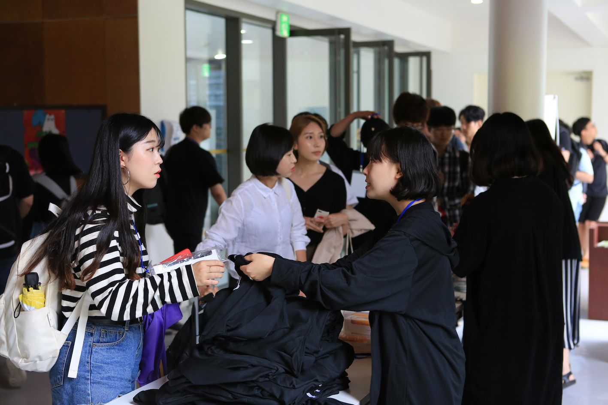</img>  
#### 아이디어 발표 장면
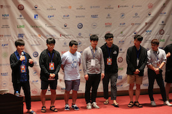</img>  
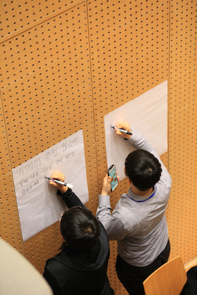</img> 
#### 멘토링 장면
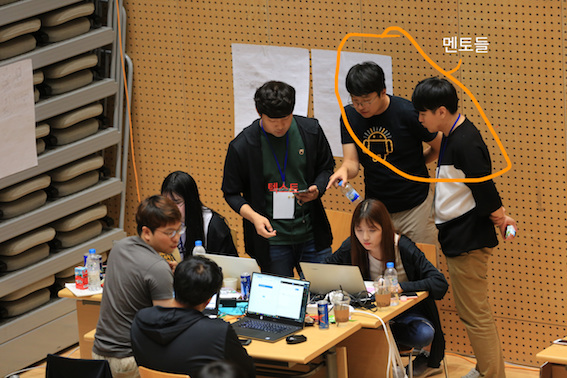</img> 
#### 최종발표 장면
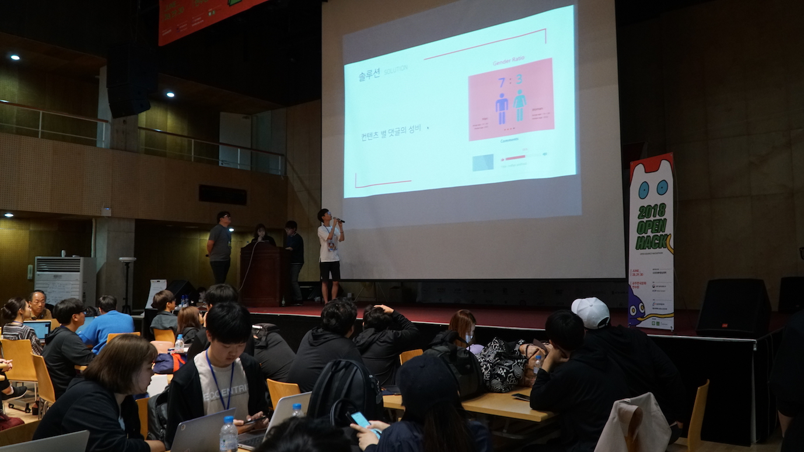</img> 
#### 단체 사진
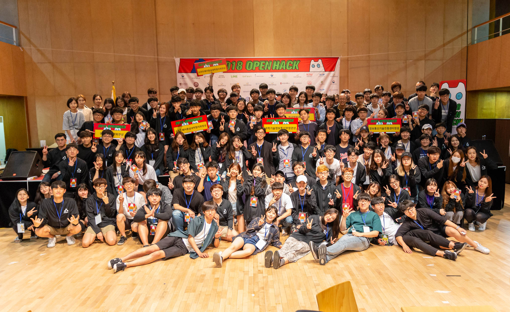</img> 

[목차로 돌아가기](#목차)

## 출력물 및 물품 사진

[무전기](#무전기),
[뱃지](#뱃지), 
[샐러드](#샐러드), 
[스폰서 굿즈](#스폰서-굿즈), 
[WiFi 스테이션](#wifi-스테이션), 
[이젤패드](#이젤패드), 
[케이블타이](#케이블타이), 
[크롬캐스트](#크롬캐스트), 
[테이핑 작업](#테이핑-작업),
[파워릴](#파워릴), 
[포토월](#포토월),
[푸드트럭](#푸드트럭), 
[X-배너](#x-배너)

#### 무전기
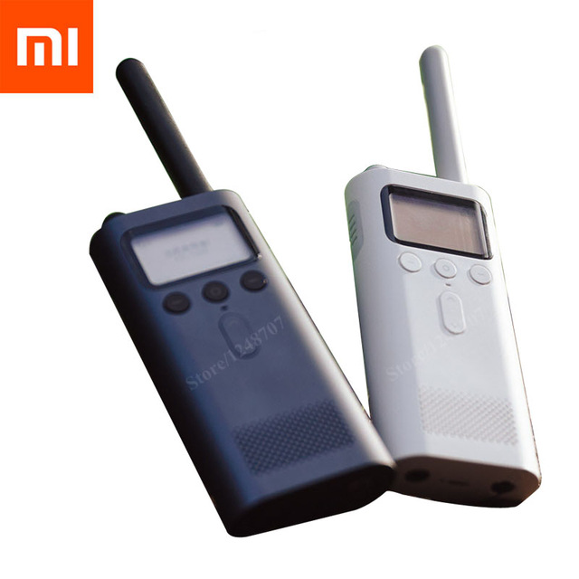</img> 
#### 뱃지
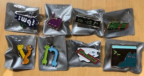</img> 
#### 샐러드
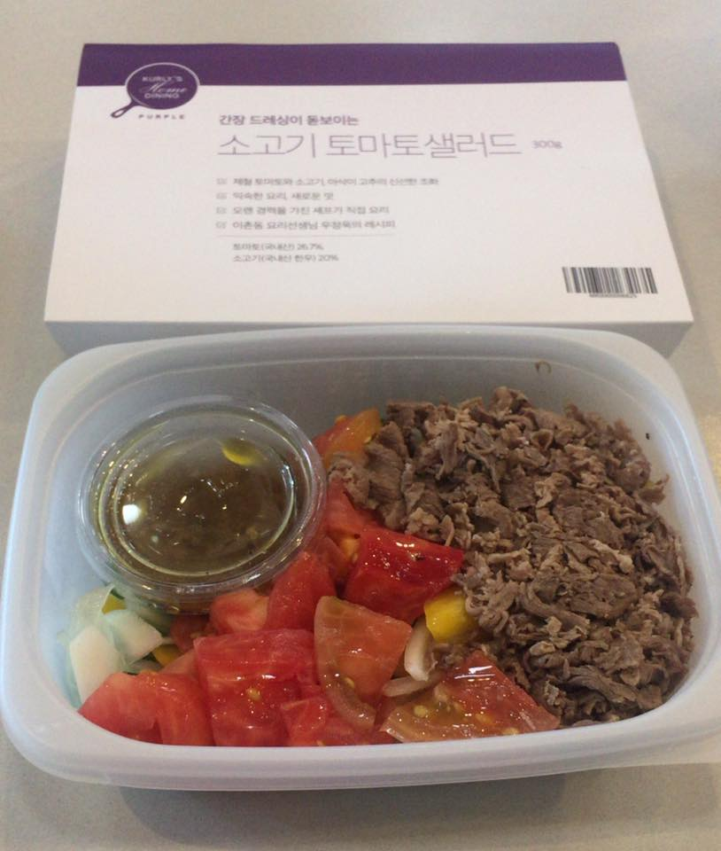</img> 
#### 스폰서 굿즈
</img> 
#### WiFi 스테이션
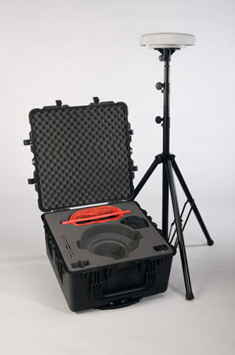</img> 
#### 이젤패드
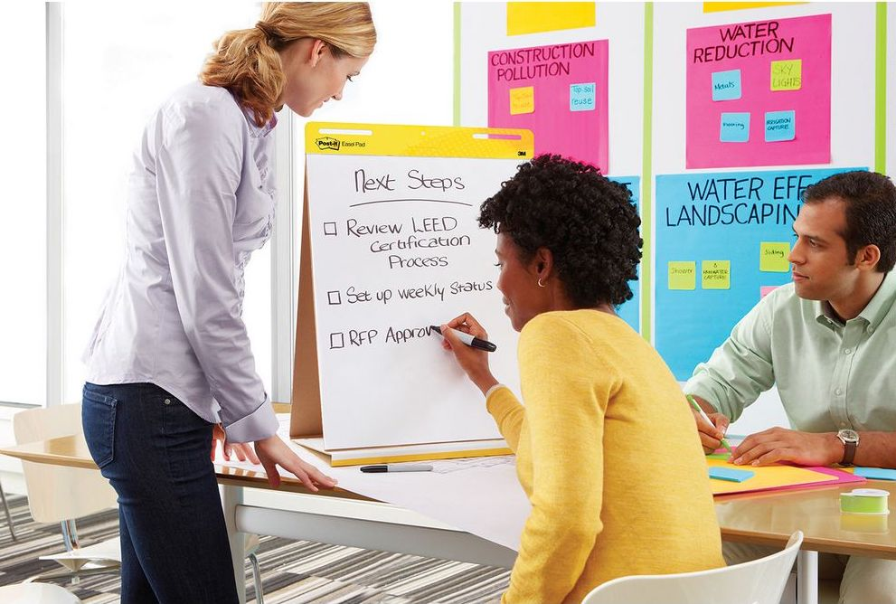</img> 
#### 케이블타이
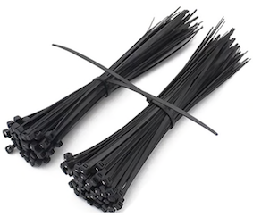</img> 
#### 크롬캐스트
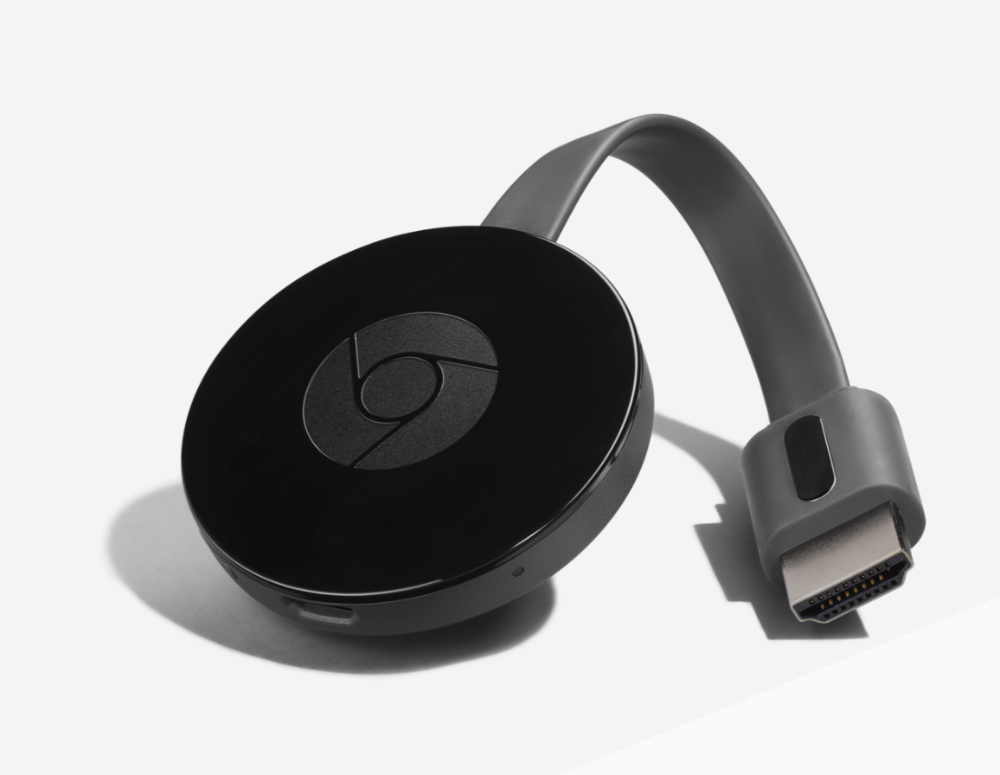</img> 
#### 테이핑 작업
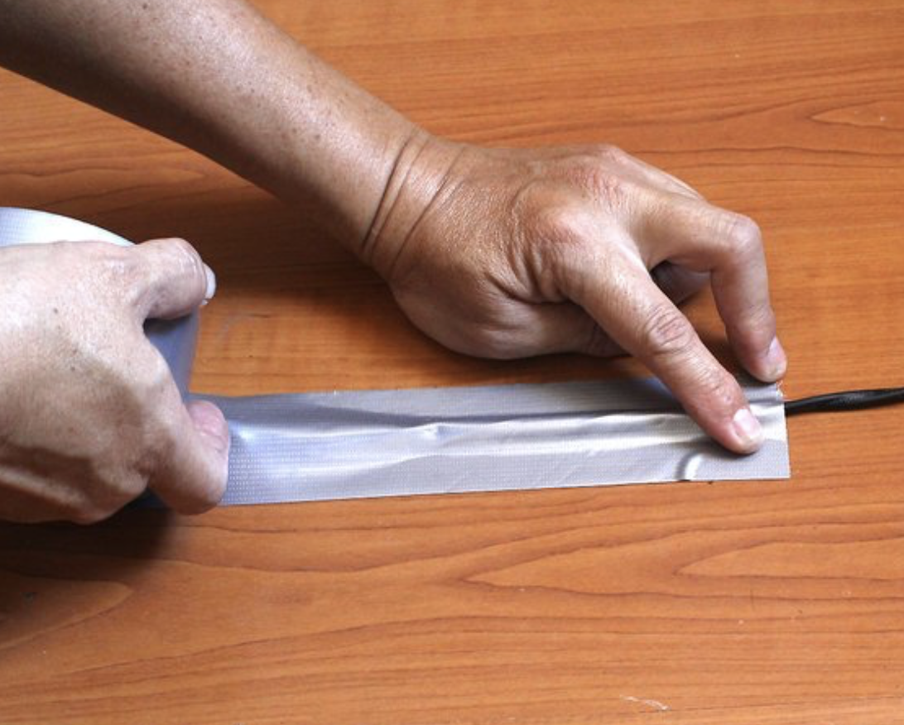</img> 
#### 파워릴
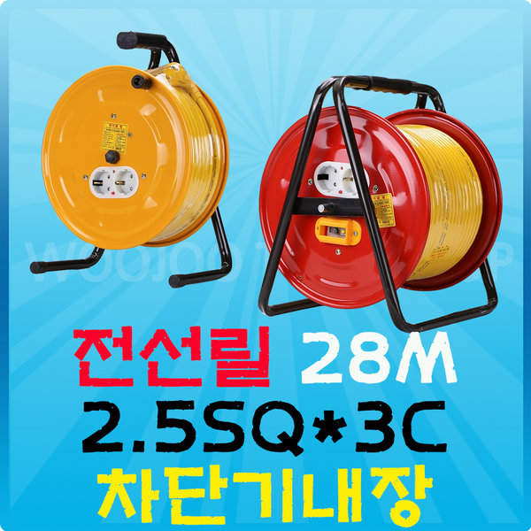</img> 
#### 포토월
</img> 
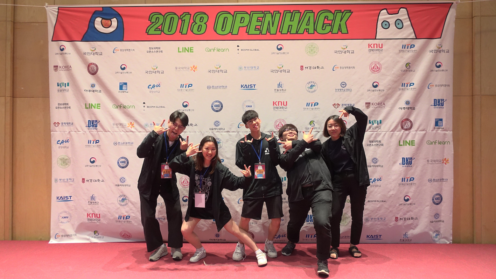</img> 
#### 푸드트럭
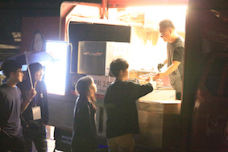</img> 
#### X 배너
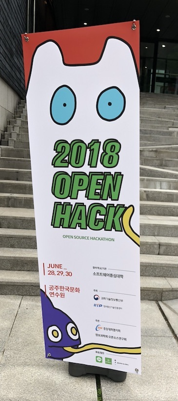</img> 

[목차로 돌아가기](#목차)

**해커톤 매뉴얼 문서의 끝**